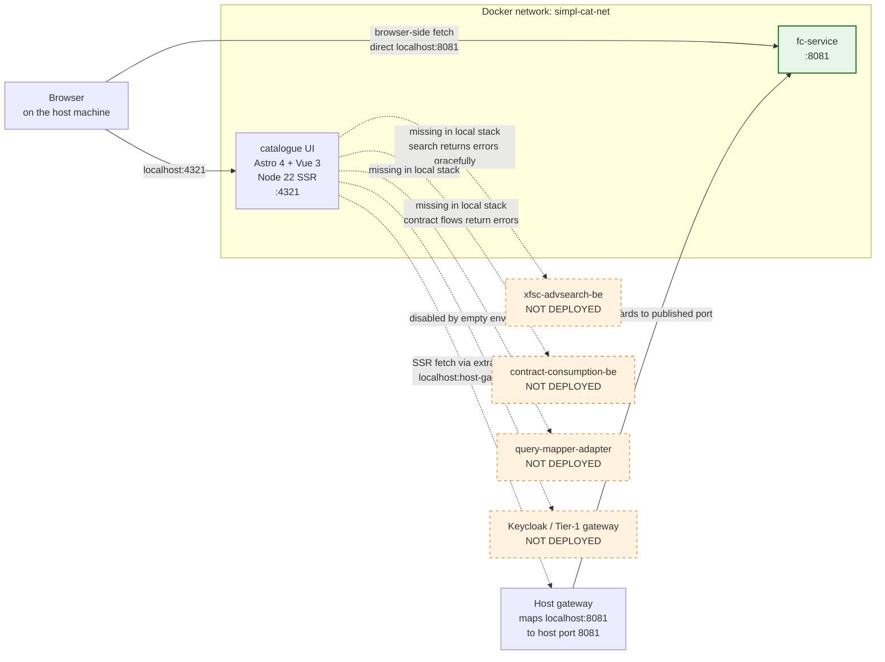

# Catalogue UI — architecture overview

A short reference for what `simpl-catalogue-client` is, what it talks to in our local stack, the networking trick that makes a single URL string work for both browser and SSR fetches, and which UI flows work vs fail gracefully.

## At a glance



Solid arrows = active in our local stack. Dashed arrows = the UI tries to reach these in production but they are not deployed locally; the UI degrades to error states for those flows.

## What the UI is

`simpl-catalogue-client` is an **Astro 4 application with Vue 3 components**, server-side rendered via `@astrojs/node`, packaged as a single-stage Docker image based on `node:22`. Its job in production is to provide a participant-facing browser UI for searching and browsing a federated catalogue, wrapping the underlying API surface (fc-service + xfsc-advsearch-be + supporting backends) into a usable interface.

In our local stack, only fc-service is wired in. The UI degrades gracefully for everything else.

## Pages exposed

```
/                                          Quick-search homepage
/status                                    Health / liveness page
/resourceDescriptions/{id}                 Single self-description detail view
```

That's the entire surface — the UI does not have a "browse all" or "list" page. To view a specific SD, use the direct URL with the SD's `id` field URL-encoded (the `did:web:...` colons become `%3A`).

## What works in our local stack

| Flow | Backend used | Status |
|---|---|---|
| `/resourceDescriptions/{id}` page | fc-service `/self-descriptions/{id}` | ✅ Works — renders offer details, billing schema, contract template, SLA agreements |
| `/status` page | none (static) | ✅ Works |
| `/` quick-search box (display) | none (static) | ✅ Renders |
| Quick search submission | xfsc-advsearch-be at `/v1/selfDescriptions?q=...` | ❌ HTTP 404 (advsearch-be not deployed; fc-service has no `/v1/...` namespace). Surfaces as `(QUICK_SEARCH_ERROR) Error details are not available` — an upstream UI bug, see SIMPL-26189 |
| Advanced search | xfsc-advsearch-be `/advanced` | ❌ Same as above |
| Contract negotiation flows | contract-consumption-be | ❌ Not deployed |

## The networking trick — `extra_hosts: ["localhost:host-gateway"]`

The UI uses Astro's `import.meta.env.PUBLIC_*` to read URLs at **two different times** for the **same code paths**:

1. **At build time** — `astro build` reads `.env` (via `dotenvx`) and bakes PUBLIC_ values into the client-side JS bundle that ships to the browser.
2. **At request time** — the SSR server (Node.js process inside the UI container) reads `process.env.PUBLIC_*` when rendering pages that fetch data on the server before HTML is sent.

Both times need to produce a URL that **the same single string** can resolve from. Our setup uses `http://localhost:8081`:

- **Browser** — runs on the host. `localhost:8081` is the host's port 8081, which Docker forwards to fc-service's container port 8081. ✅
- **SSR inside the UI container** — needs `localhost` to mean the same host. By default, `localhost` inside a container means the container itself, where there's nothing on port 8081. To fix this, `docker-compose.yml` declares `extra_hosts: ["localhost:host-gateway"]` on the UI service. This makes `localhost` inside the container resolve to the Docker host gateway, which maps back to host port 8081 → fc-service container. ✅

Without this `extra_hosts` line, server-side rendered pages would fail every fc-service fetch with a connection refused, even though the browser-side fetch would work. The symptom would be: pages render but with no data, accompanied by a red error banner.

## Build-time vs runtime env vars

`docker-compose.yml` for the `ui` service sets the PUBLIC_ vars in **both** places:

1. `start.sh` writes a `.env` file into `repos/simpl-catalogue-client/` before `docker build` — these values get baked into the client bundle.
2. The compose `environment:` block sets the same vars again — these are read by the SSR Node process at request time.

Skipping either causes a different kind of breakage:

- Without `.env` at build time: client-side fetches use undefined URLs (you'd see `undefined/v1/selfDescriptions` in the network log). 
- Without `environment:` at runtime: server-side fetches use undefined URLs (the seemingly identical `Failed to parse URL from undefined/v1/selfDescriptions` error, but only for SSR-rendered pages).

The two sets of values must match. `start.sh` writes them once and `docker-compose.yml` mirrors them — keep both in sync if you change one.

## What's intentionally NOT here

| Component | Status here | What it would do |
|---|---|---|
| **xfsc-advsearch-be** | Not deployed | Provides keyword + advanced search via `/v1/selfDescriptions?q=...`. Without it, search submissions fail with the swallow-error pattern (SIMPL-26189). |
| **query-mapper-adapter** | Not deployed | Optional override for advanced search — when present, the UI routes search through it instead of advsearch-be. Both being absent is functionally equivalent. |
| **contract-consumption-be** | Not deployed | Initiates ContractNegotiation and TransferProcess workflows. The UI has buttons for these in the SD detail page; clicking them errors out. |
| **Keycloak + Tier-1 gateway** | Not deployed | Production auth. The UI's empty Keycloak env vars make it skip the auth flow entirely — every request goes through unauthenticated. |

## Configuration that matters

Set both at build time (in `repos/simpl-catalogue-client/.env`, written by `start.sh`) AND at runtime (in compose `environment:`):

| Var | Value in our stack | Purpose |
|---|---|---|
| `PUBLIC_AUTH_KEYCLOAK_SERVER_URL` | (empty) | Disables Keycloak auth flow |
| `PUBLIC_AUTH_KEYCLOAK_REALM` | (empty) | Disables Keycloak auth flow |
| `PUBLIC_AUTH_KEYCLOAK_CLIENT_ID` | (empty) | Disables Keycloak auth flow |
| `PUBLIC_FEDERATED_CATALOGUE_API_URL` | `http://localhost:8081` | Browse + SD detail (works) |
| `PUBLIC_SEARCH_API_URL` | `http://localhost:8081` | Search target (404s — advsearch-be not deployed) |
| `PUBLIC_SEARCH_API_VERSION` | `v1` | Path prefix for search |
| `PUBLIC_CONTRACT_CONSUMPTION_API_URL` | (empty) | Disables contract flows |
| `PUBLIC_CONTRACT_CONSUMPTION_API_VERSION` | `v1` | Path prefix |
| `PUBLIC_AGENT_TYPE` | `consumer` | UI persona — affects which flows are visible |
| `USE_MOCK_APIS` | `false` | Use real fc-service, not test fixtures |

## Process model

The UI container runs a single Node.js process via `CMD ["node", "./dist/server/entry.mjs"]`. On startup:

1. Astro/Node listens on `0.0.0.0:4321`.
2. On first request, the SSR pipeline imports the route handler, runs it, fetches data from PUBLIC_* URLs as needed, hydrates the Vue components, returns HTML.
3. Subsequent client-side navigation re-hydrates components in the browser; from that point fetches go directly browser → API URL (no SSR pass).

There are no databases, queues, or background workers in the UI tier. It's stateless front-end glue.

## See also

- [Manual setup walkthrough](catalogue-ui-manual-setup.md) — step-by-step build and run.
- [fc-service architecture overview](fc-service-architecture.md) — the backend the UI calls.
- [Main README](../README.md) — quick-start, status, and limitations.
