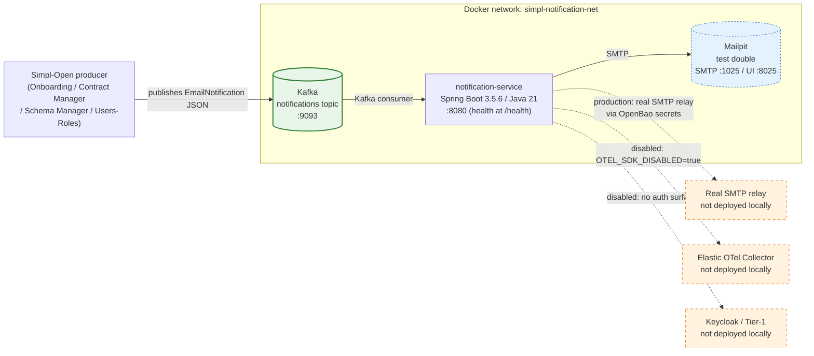

# notification-service — architecture overview

A short reference for what `notification-service` is, what it talks to in our local stack, and what it would talk to in a fuller deployment.

## At a glance

Solid arrows = hard dependencies (must be reachable). Dashed arrows = disabled / optional in this stack.

## What runs in our local stack

| Component | Image | Port(s) | Purpose |
|---|---|---|---|
| `notification-service` | `simpl-notification-service:local` | `8081→8080` | Kafka consumer; dispatches emails |
| `kafka` | `confluentinc/cp-kafka:7.5.0` | `9093` | Message broker; holds `notifications` topic |
| `zookeeper` | `confluentinc/cp-zookeeper:7.5.0` | — (internal) | Kafka coordination |
| `kafka-ui` | `provectuslabs/kafka-ui:v0.7.1` | `9081` | Browse topics and inspect messages |
| `mailpit` _(test only)_ | `axllent/mailpit:v1.21` | `1025` (SMTP), `8025` (UI) | Test double for the production SMTP relay — captures outbound email for inspection. Via `docker-compose.test.yml`. |

## Why email capture with Mailpit

In production, the notification service connects to an SMTP relay (configured via OpenBao secrets). Locally we use Mailpit: a zero-config SMTP server that accepts any message without authentication and provides a web UI to inspect what was sent. This lets us verify the end-to-end flow (Kafka message → email dispatch) without needing a real mail server or external credentials.

## What's intentionally NOT here

| Component | Status here | What it would do |
|---|---|---|
| Keycloak / Tier-1 gateway | Not deployed | AuthN/AuthZ — irrelevant; the service has no HTTP API |
| ArgoCD | Not deployed | Deployment orchestrator — out of scope for component evaluation |
| HashiCorp Vault / OpenBao | Not deployed | Secrets management — plain env vars used instead |
| Elastic OTel Collector | Not deployed | Telemetry export — `OTEL_SDK_DISABLED=true` suppresses the agent |
| Kafka SASL | Disabled | Production uses SASL_SSL; PLAINTEXT used locally |
| HA Kafka | Not configured | Single broker, replication factor 1 |

## Configuration that matters in our stack

| Env var | Value | Note |
|---|---|---|
| `KAFKA_BOOTSTRAP_SERVER` | `kafka:9093` | Internal Docker hostname |
| `KAFKA_SECURITY_PROTOCOL` | `PLAINTEXT` | Overrides production SASL_SSL |
| `SMTP_HOST` | `mailpit` | Internal Docker hostname |
| `SPRING_MAIL_PORT` | `1025` | Overrides hardcoded `587` in `application.properties` |
| `SPRING_MAIL_PROPERTIES_MAIL_SMTP_AUTH` | `false` | Overrides hardcoded `true` — Mailpit needs no auth |
| `SPRING_MAIL_PROPERTIES_MAIL_SMTP_STARTTLS_ENABLE` | `false` | Overrides hardcoded `true` — Mailpit uses plain SMTP |
| `OTEL_SDK_DISABLED` | `true` | Suppresses Elastic OTel agent loaded by Dockerfile CMD |
| `PROJECT_RELEASE_VERSION` | `local` | Required for `mvnw` — `pom.xml` uses `${env.PROJECT_RELEASE_VERSION}` |
| `MANAGEMENT_ENDPOINTS_WEB_BASE_PATH` | `/` | Policy: health endpoint must not be under `/actuator`; exposes at `/health` |

## Process model

1. Kafka produces an `EmailNotification` JSON message to the `notifications` topic (from any upstream Simpl-Open service).
2. `notification-service` consumer group `notifications-id` picks up the message.
3. The service calls `JavaMailSender` with the `to`, `cc`, `subject`, and `message` fields from the payload.
4. Mailpit accepts the SMTP connection on port 1025 and stores the email for inspection in its web UI.

No state is persisted. If the service restarts, Kafka offset management (group `notifications-id`) ensures messages are not re-delivered.

## See also

- [Manual setup walkthrough](notification-service-manual-setup.md)
- [Main README](../README.md)
