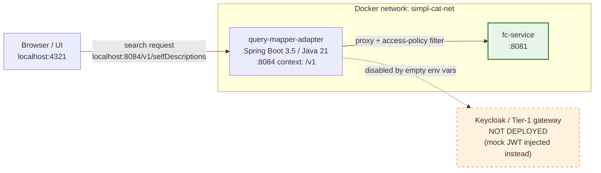

# query-mapper-adapter — architecture overview

A short reference for what `query-mapper-adapter` (aka `poc-gaia-edc` / `catalogue-adapter`) is, what it does in our local stack, and where it fits in a fuller deployment.

## At a glance

Solid arrows = active in our local stack. Dashed arrows = the adapter uses in production but not locally.

## What it is

`query-mapper-adapter` is a thin Spring Boot proxy that sits between the catalogue UI (and other consumers) and `fc-service`. It adds two things that fc-service itself does not provide:

1. **Access-policy filtering** — reads each SD's `simpl:servicePolicy.simpl:access-policy` JSON field, checks whether the caller's identity attribute (e.g. `CONSUMER`) is listed as a permitted assignee, and strips out SDs the caller cannot access before returning results.
2. **Role-gated publisher endpoints** — `GET/PATCH /v1/participants/resourceDescriptions` enforce publisher roles (`DATA_PROVIDER_PUBLISHER`, `APP_PROVIDER_PUBLISHER`, `INFRA_PROVIDER_PUBLISHER`).

Quick search and advanced search both proxy through to fc-service's internal endpoints (`/selfDescriptions/quickSearch`, `/selfDescriptions/advancedSearch`) and post-process the results.

## Endpoints

All endpoints are mounted under the `/v1` context path.

| Method | Path | Who calls it | Notes |
|---|---|---|---|
| `GET` | `/v1/selfDescriptions` | UI quick-search | `?searchString=`, `?page=`, `?pageSize=`. Proxies to fc-service quickSearch + filters by access policy. |
| `POST` | `/v1/selfDescriptions/advancedSearch` | UI advanced-search | JSON body. Proxies to fc-service advanced search + filters. |
| `GET` | `/v1/participants/resourceDescriptions` | Publisher UI | Requires publisher role. `?orderBy=`. |
| `GET` | `/v1/participants/resourceDescriptions/{id}` | Publisher UI | Fetch single resource description. |
| `PATCH` | `/v1/participants/resourceDescriptions/{id}` | Publisher UI | Revoke. Requires publisher role. |

## Access-policy check

The adapter decodes the caller's JWT (or reads the `User-Attributes` header, which takes precedence) to extract the `identity_attributes` claim — a list of role strings like `["CONSUMER"]`. For each SD returned by fc-service, it parses the `simpl:access-policy` field (a stringified ODRL JSON object) and checks whether any of the caller's identity attributes matches a `permission[].assignee.uid`. SDs that don't grant access are dropped silently.

In our local stack the UI sends no `Authorization` header, so the adapter falls back to a **hardcoded mock JWT** embedded in the source (`BEARER_TOKEN_MOCK`). That token carries `identity_attributes: ["CONSUMER"]`. Seed data must therefore contain an access-policy that grants access to `CONSUMER` — this is exactly what `seed.sh` injects when patching the upstream example SDs (see [known limitations in the main README](../README.md)).

## Why the typo in the env var name

`FEDERATED_CATALOOGUE_CLIENT_URL` (extra `O` in `CATALOOGUE`) is an upstream typo in `application.properties`. The env var name must match the typo'd property name for Spring to pick it up. It is intentionally preserved in `docker-compose.yml`.

## What's intentionally NOT here

| Component | Status here | What it would do |
|---|---|---|
| Keycloak / Tier-1 gateway | Not deployed — mock JWT injected | In production the gateway authenticates the caller and forwards a real JWT. The mock JWT is **not for production use**. |
| `xfsc-advsearch-be` | Not deployed | A separate advanced-search backend. The adapter can route to it as an alternative to fc-service's built-in advanced search; unused locally. |
| Real ODRL policy engine | Not deployed | The current access-policy check is a simple assignee-UID string match. A production deployment would evaluate full ODRL constraint trees (date ranges, etc.). |

## Configuration that matters in our stack

| Env var | Value | Purpose |
|---|---|---|
| `FEDERATED_CATALOOGUE_CLIENT_URL` | `http://fc-service:8081` | fc-service base URL (note the typo'd property name) |
| `SERVER_SERVLET_CONTEXT_PATH` | `/v1` | Mounts all endpoints under `/v1` to match what the UI builds |
| `OTEL_SDK_DISABLED` | `true` | Suppresses OpenTelemetry startup noise |

## See also

- [Manual setup walkthrough](query-mapper-adapter-manual-setup.md) — step-by-step build and run.
- [fc-service architecture overview](fc-service-architecture.md) — the backend QMA proxies to.
- [Catalogue UI architecture overview](catalogue-ui-architecture.md) — the UI that calls QMA.
- [Main README](../README.md) — quick-start, status, and limitations.
