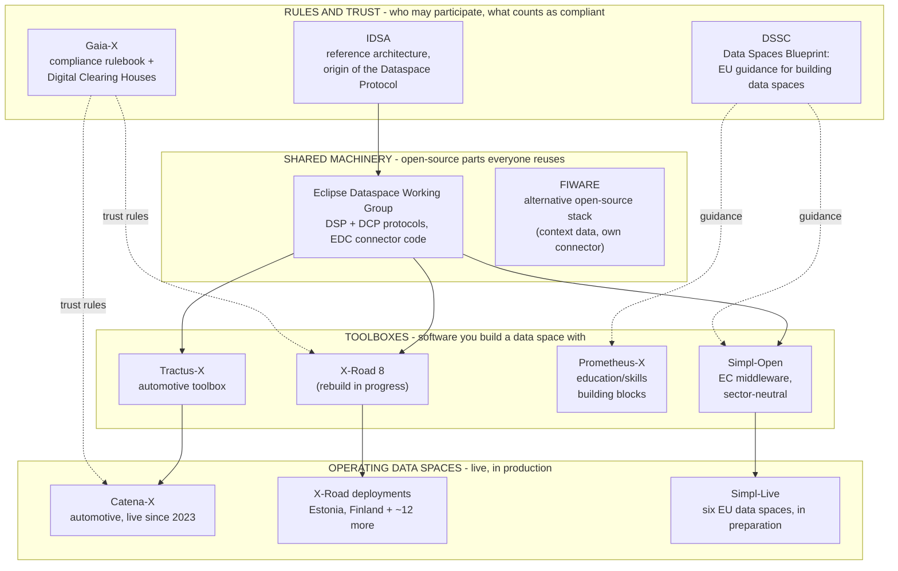

# The European data-space landscape: who does what

> A non-technical orientation guide to how **Simpl**, **Gaia-X**, **DSSC**, **IDSA**, **EDC and the
> Eclipse Dataspace Working Group**, **Tractus-X**, **Catena-X**, **Prometheus-X**, **X-Road**, and
> **FIWARE** relate to each other. Written for readers who keep meeting these names and want the
> map, not the engineering.
>
> - Facts checked against each initiative's official site in **July 2026**; Simpl facts also from
>   programme knowledge.
> - Deeper technical companions in this folder:
>   [`simpl-dssc-mapping.md`](./simpl-dssc-mapping.md) and
>   [`simpl-tractusx-comparison.md`](./simpl-tractusx-comparison.md).

---

## The short answer

These initiatives are mostly **not competitors**. They sit at different layers of the same
European effort to let organisations share data without giving up control of it. Some write the
**rules**, some write the **software**, some **run actual data spaces**, and one exists purely to
**guide** everyone else. Nearly every name on the list touches the others somewhere.

A loose analogy: building a city.

- **IDSA** writes the building codes (reference architecture, and the origin of the common
  "language" connectors speak).
- **Gaia-X** runs the trust system: the rulebook for who may claim to be compliant, plus the
  inspectors (clearing houses) who verify it.
- **DSSC** publishes the city-planning guidebook (the Data Spaces Blueprint) that tells new
  neighbourhoods how to organise themselves.
- **The Eclipse Dataspace Working Group** is the parts factory: the shared open-source components
  (EDC) and the finalised versions of the common language (DSP, DCP) everyone builds with.
- **Simpl-Open**, **Tractus-X**, **Prometheus-X**, and **FIWARE** are house kits assembled from
  those parts, each with a different philosophy and audience.
- **Catena-X** is a finished, inhabited neighbourhood (automotive). **X-Road** is an older, very
  inhabited neighbourhood (government data exchange) currently renovating to join the same street
  plan.

---

## The layer map

Dotted lines are rules and guidance; solid lines are code and specifications actually flowing.

---

## One paragraph per player

### IDSA - the standards association

The International Data Spaces Association (a German member association, based in Dortmund) is
where the idea of "data sovereignty through connectors" was first written down as a reference
architecture (IDS-RAM). Its most consequential product is the **Dataspace Protocol (DSP)**: the
common language two data-space participants use to find offers, agree contracts, and transfer
data. IDSA handed the protocol to the Eclipse Foundation for neutral stewardship, and since
December 2025 it is on a formal track to become an **ISO/IEC standard**. IDSA today is best
understood as the standards voice; the engineering happens at Eclipse.

### Gaia-X - the trust rulebook

Gaia-X (a Brussels-based association of cloud and data companies) does **not** operate data
spaces and is mostly not software. It defines what "trustworthy" means: a **Compliance Document**
(the rules a service must satisfy, currently version 2.5.0, March 2026) and a network of **Digital
Clearing Houses**, operated by companies like T-Systems and Aruba, that verify participants and
issue signed proof of compliance. Its current generation ("Danube", Gaia-X 3.0) deliberately
separates the technical plumbing from the compliance rules so different data spaces can adopt the
trust layer without adopting any particular stack. Other initiatives, including Catena-X,
Prometheus-X, and the X-Road rebuild, point at Gaia-X when asked "who says we are trustworthy?".

### DSSC - the guidebook

The Data Spaces Support Centre is an EU-funded support project (Digital Europe Programme), not an
association and not a software project. Its deliverable is the **Data Spaces Blueprint**, the
reference handbook telling new European data spaces how to organise business, governance, legal,
and technical matters. **Version 3.0 (early 2026) is the concluding version of the project.**
Gaia-X and IDSA sit on the Blueprint's architecture board, and the Blueprint explicitly plans
alignment with Simpl. If Simpl-Open is a product, the Blueprint is the closest thing to its
official requirements catalogue from the data-space community side (see
[`simpl-dssc-mapping.md`](./simpl-dssc-mapping.md) for the detailed fit).

### Eclipse Dataspace Working Group and EDC - the shared machinery

The neutral home where the specifications and shared code actually live: the **Dataspace Protocol**
(DSP, version 1.0.0, July 2025), the **Decentralized Claims Protocol** (DCP, for exchanging
identity credentials, also 1.0.0), and **EDC, the Eclipse Dataspace Components**, the open-source
connector framework. EDC is the single biggest piece of shared DNA in this landscape: Simpl-Open
builds its Agent on it, Tractus-X ships a hardened distribution of it, X-Road 8 will be based on
it, and aerospace and manufacturing initiatives assemble their connectors from it. When two of
these initiatives cooperate, this working group is usually the table they meet at.

### Simpl - the EC's middleware

Simpl is a European Commission programme (DG CONNECT) with three products: **Simpl-Open** (the
open-source middleware itself, EUPL-1.2, built under procurement on code.europa.eu),
**Simpl-Labs** (a try-it-out environment), and **Simpl-Live** (deployments for six Common
European Data Spaces, including health, open science, procurement, and language). Its defining
choice is **sector neutrality**: it ships the generic machinery (connector, catalogue, identity,
contracts, orchestration) and deliberately no sector content. It is the only player on this list
owned by a public institution rather than an association or foundation.

### Catena-X and Tractus-X - the flagship data space and its toolbox

Easily the most confused pair on the list, because they are two faces of one effort. **Catena-X**
is the automotive industry's data space: an association (founded by BMW, Mercedes-Benz, Bosch,
SAP, Siemens, ZF and others) with standards, a certification scheme, commercial operating
companies (Cofinity-X first), and production use since 2023 for things like parts traceability
and product carbon footprints. **Tractus-X** is the Eclipse open-source project containing the
software that implements it. Rule of thumb: Catena-X is the club and its rules; Tractus-X is the
code. Catena-X matters beyond automotive because it is the **template other sectors copy**
(manufacturing, aerospace), and those copies reuse Tractus-X parts. The detailed technical
comparison with Simpl is in [`simpl-tractusx-comparison.md`](./simpl-tractusx-comparison.md).

### Prometheus-X - the education and skills stack

A French-rooted non-profit community building around 20 open-source building blocks, "adapted
mostly but not exclusively" to the education and skills sector. Its distinguishing idea is putting
the **individual and their consent** at the centre (personal-data intermediaries), where most of
the other players think organisation-to-organisation. It positions itself inside the same family
(Gaia-X working groups, DSSC expert) and is best seen as a leaner, sector-flavoured alternative
toolbox to Simpl-Open, and a likely federation partner where personal data is involved.

### X-Road - the veteran converging on the family

X-Road (MIT-licensed, maintained by the Nordic Institute for Interoperability Solutions in
Tallinn) is the odd one out: it predates the whole data-space wave, running production government
data exchange since 2001 in Estonia and Finland and adopted in over a dozen countries. It is
proof that large-scale, secure, decentralised data exchange is not a new idea. Its next major
version, **X-Road 8 "Spaceship"** (beta since October 2025, production targeted in 2026), is being
rebuilt on EDC and the Dataspace Protocol with Gaia-X compatibility, which means the veteran is
converging on exactly the stack Simpl starts from.

### FIWARE - the adjacent stack

FIWARE (a German foundation, born from EU smart-city programmes) maintains its own open-source
platform centred on **context data** (live state of cities, sensors, systems) rather than
file-style data sharing, with its own Data Space Connector. It matters here for two reasons: it
is one quarter of the **DSBA** (Data Spaces Business Alliance: Gaia-X + IDSA + FIWARE + BDVA),
the umbrella that pushed technical convergence between the families; and FIWARE-based data spaces
are a real integration scenario for Simpl (the Smart Communities Data Space pilots run FIWARE
technology, and bridging it to Simpl's connector world is an actively analysed topic in the
programme).

---

## Who does what, at a glance

| | What it fundamentally is | Sector | Run by | Status mid-2026 | Relationship to Simpl |
|---|---|---|---|---|---|
| **IDSA** | Standards association | Any | Member association (DE) | RAM 4 stable; DSP heading into ISO | Simpl implements the protocol IDSA originated |
| **Gaia-X** | Trust rulebook + verification network | Any | Member association (BE) | Compliance 2.5.0; "Danube" generation | Simpl aligns with Gaia-X trust concepts and self-descriptions |
| **DSSC** | EU guidance project (Blueprint) | Any | EU-funded project | Blueprint v3.0 = concluding version | Blueprint explicitly aligns with Simpl; Simpl maps well onto it |
| **Eclipse DSWG / EDC** | Shared protocols + connector code | Any | Eclipse Foundation WG | DSP and DCP at 1.0.0; EDC active | Simpl-Open's connector is built on EDC |
| **Simpl** | Public middleware programme | Any (by design) | European Commission | Building; Simpl-Live deployments in preparation | (is Simpl) |
| **Tractus-X** | Open-source toolbox for Catena-X | Automotive | Eclipse Foundation | Quarterly releases, mature | Sibling toolbox on the same EDC base; source of extensions Simpl reuses |
| **Catena-X** | Operating data space + association | Automotive | Industry association + operators | Fully operational since 2023 | The template Simpl gets measured against; a candidate governance model |
| **Prometheus-X** | Building-block community | Education/skills first | Non-profit association | Active, ~20 building blocks | Alternative toolbox; potential federation partner (consent focus) |
| **X-Road** | Government data-exchange software | Public sector | NIIS (EE/FI) | v7 in production in 14+ countries; v8 beta | Converging on Simpl's stack (EDC + DSP) from the opposite direction |
| **FIWARE** | Alternative open-source stack | Smart cities/context data | Foundation (DE) | Active; DSBA member | Bridge scenario for Smart Communities Data Space pilots |

---

## Common confusions, answered in one line each

- **Catena-X vs Tractus-X?** Catena-X is the data space and its rules; Tractus-X is the
  open-source code that implements it.
- **Is Gaia-X software?** Essentially no: it is a compliance rulebook plus verification services;
  the software lives elsewhere (Eclipse, and earlier the XFSC components that Simpl reuses).
- **Gaia-X vs DSSC?** Gaia-X says what a *trustworthy participant* looks like; DSSC says how to
  *build and govern a data space*. One is rules, the other is a handbook.
- **IDSA vs Eclipse?** IDSA wrote the protocol's first drafts; Eclipse now hosts and evolves the
  official specification and the reference code.
- **EDC vs DSP?** DSP is the language; EDC is the best-known speaker of it.
- **Simpl vs DSSC?** DSSC is the guidance; Simpl-Open is one concrete software implementation a
  data space can adopt (the mapping between them is this folder's other document).
- **Simpl vs Catena-X?** Simpl is middleware for *any* data space; Catena-X *is* a data space, for
  one sector, with its own older stack. They share the EDC/DSP foundations but not code ownership.
- **Why does everything end in -X?** Gaia-X started the naming fashion; Catena-X, Tractus-X,
  Eona-X, Factory-X, Prometheus-X followed. X-Road's X is a coincidence two decades older.

---

## How they actually connect: three flows

1. **Standards flow.** IDSA's reference architecture became the Dataspace Protocol; the protocol
   (with the credentials protocol DCP) moved to the Eclipse Dataspace Working Group; both hit
   version 1.0.0 in July 2025 and entered the ISO/IEC standardisation pipeline in December 2025.
   Everyone downstream (Simpl, Tractus-X, X-Road 8, FIWARE via DSBA convergence) implements or
   tracks that one protocol family. This is the strongest force pulling the landscape together.
2. **Code flow.** EDC is reused everywhere: Simpl embeds it, Tractus-X distributes a hardened
   version of it, X-Road 8 rebuilds on it, newer sector spaces assemble connectors from its
   extension ecosystem. Improvements travel through the shared upstream rather than bilaterally,
   which is why Simpl can adopt, say, a Tractus-X streaming extension without any formal
   relationship between the two programmes.
3. **Trust and guidance flow.** Gaia-X supplies the compliance vocabulary and verification
   machinery that operating spaces reference; DSSC's Blueprint tells new spaces how to organise
   and explicitly aligns with Simpl. Neither ships the plumbing; both shape what the plumbing must
   satisfy.

Where does Simpl sit in all this? It is the **public-sector entrant in the toolbox layer**:
protocol-wise a sibling of Tractus-X and Prometheus-X on the shared Eclipse machinery,
guidance-wise the implementation the DSSC Blueprint points to, and strategically the EC's bet
that future Common European Data Spaces should not each have to reinvent what Catena-X spent five
years and an industry consortium building.

---

## Sources

Checked July 2026, official sites only:

- IDSA and DSP: internationaldataspaces.org (reference-architecture page; DSP-to-ISO announcements) and projects.eclipse.org/projects/technology.dataspace-protocol-base
- Gaia-X: gaia-x.eu (2026 General Assembly report; GXDCH article) and docs.gaia-x.eu (Compliance Document 2.5.0)
- DSSC: blueprint.dssc.eu (Blueprint v3.0 and about page)
- Eclipse Dataspace Working Group: dataspace.eclipse.org; projects.eclipse.org (EDC, DCP)
- Tractus-X / Catena-X: eclipse-tractusx.github.io, catenax-ev.github.io, catena-x.net
- Prometheus-X: prometheus-x.org (building-blocks page)
- X-Road: x-road.global (dataspaces and licence pages), niis.org (X-Road 8 beta announcement)
- FIWARE and DSBA: fiware.org, data-spaces-business-alliance.eu
- Simpl: simpl-programme.ec.europa.eu (products, FAQ), code.europa.eu/simpl
- Knowledge-base companions: the DSSC mapping and Tractus-X comparison documents in this folder,
  plus internal comparison notes (Prometheus-X vs Simpl, X-Road vs Simpl, Simpl-Open vs Catena-X)
