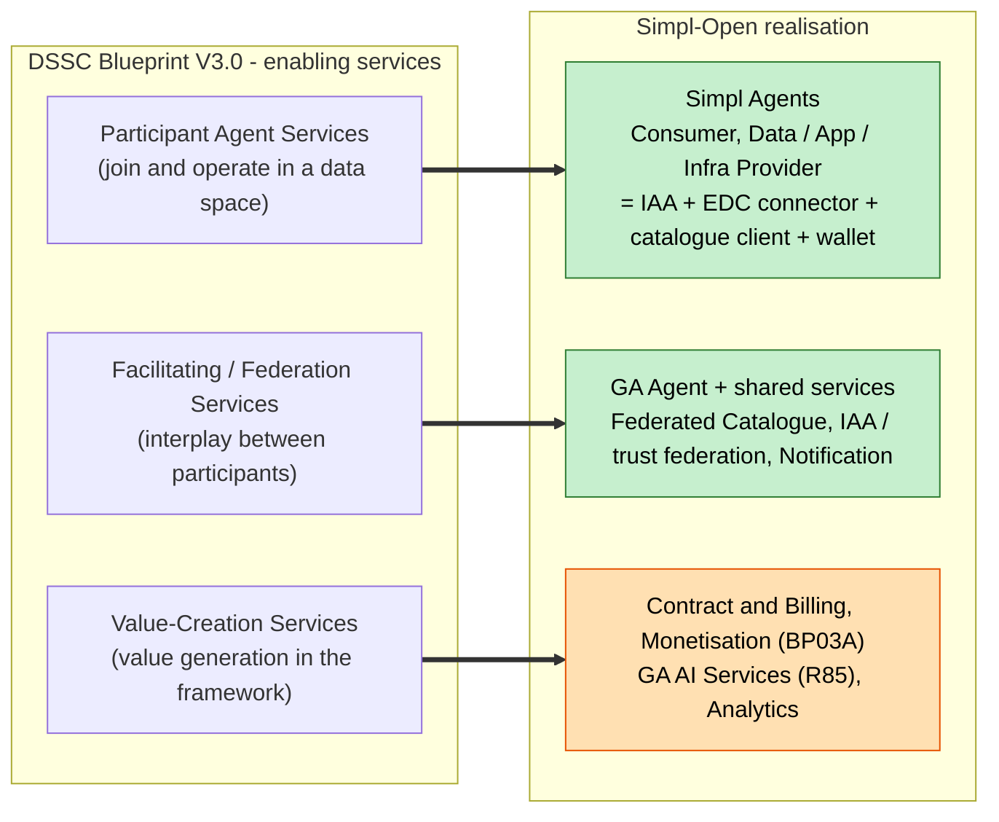
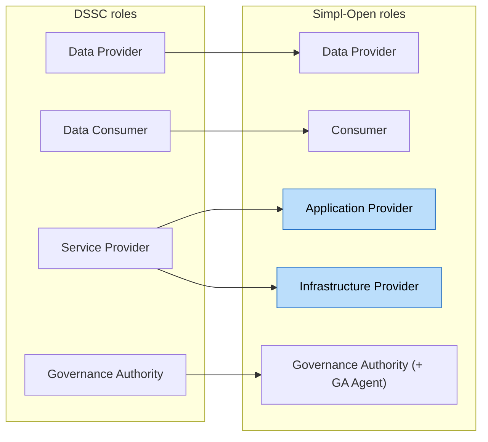
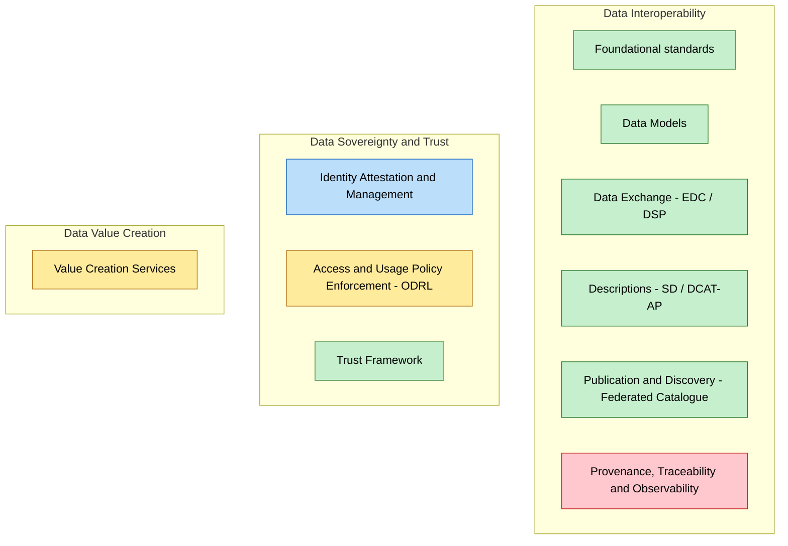
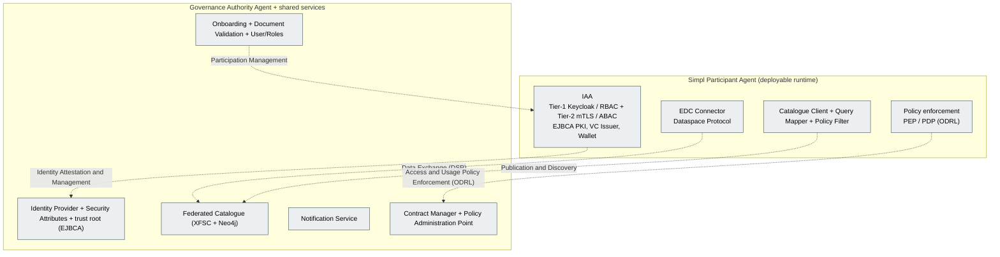
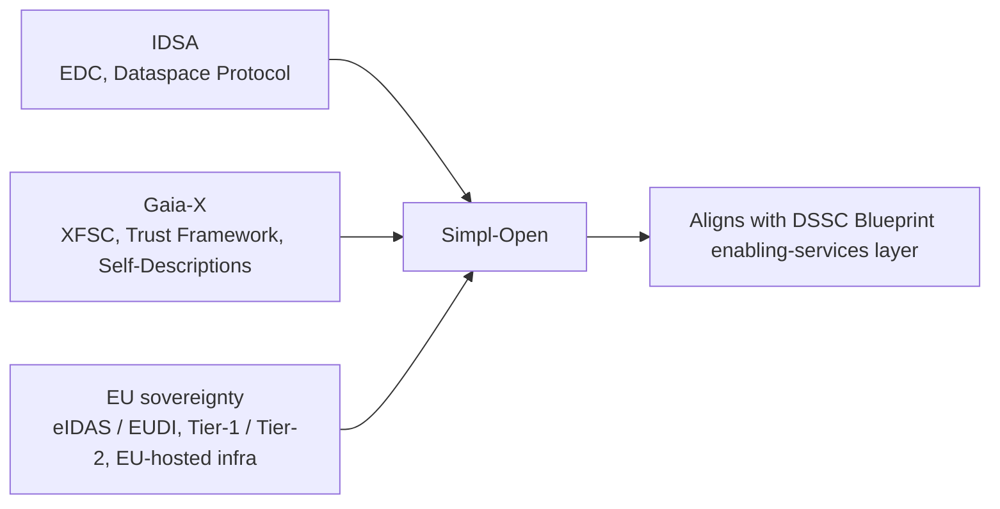

# Simpl-Open ↔ DSSC Data Spaces Blueprint mapping

> Full mapping of **Simpl-Open** onto the **DSSC Data Spaces Blueprint V3.0** (March 2025),
> focused on the blueprint's **key concepts** and **building blocks**.
>
> - **Blueprint source:** [blueprint.dssc.eu](https://blueprint.dssc.eu/?pane=intro) (V3.0, the living online version).
> - **Simpl source:** the Functional and Technical Architecture Specifications (FTA) component
>   inventory, i.e. the 99-component solution-to-service mapping derived from the
>   `simpl/simpl-open/architecture` repository.
> - **Coverage ratings reflect Simpl's current build state, not target state**, so they move as
>   billing, provenance/lineage, and the R85 GA AI Services capability land.

---

## How to read this document

**Coverage legend**

| Symbol | Meaning |
|:--:|---|
| ✅ | Full - Simpl covers the blueprint building block with production or near-production components. |
| 🟡 | Partial - covered in part; a meaningful slice is missing or immature. |
| 🟠 | Roadmap - present in the Simpl technology roadmap only, not yet built. |
| 🔴 | Gap - not addressed today. |
| ⟳ | Divergent by design - Simpl deliberately does it differently from the blueprint. |
| ➕ | Simpl exceeds - Simpl goes beyond what the blueprint prescribes. |

**The one-line framing.** Simpl-Open is best understood as **one concrete, opinionated
implementation of the DSSC "enabling services" layer**: EDC-based for data exchange,
Gaia-X / XFSC-based for descriptions and credentials, and tuned for EU sovereignty
(eIDAS/EUDI, a bespoke Tier-1 / Tier-2 identity model, EU-hosted infrastructure). It realises
the DSSC *conceptual model* almost 1:1 at the agent level, aligns well on interoperability and
sovereignty, and is thinnest exactly where the blueprint itself is least prescriptive: value
creation, provenance, and the marketplace.

---

## 1. Conceptual model: the enabling-services triad

The DSSC conceptual model splits enabling services into three groups. Simpl maps onto this almost
perfectly, which is the single strongest alignment in the whole mapping.

| DSSC enabling-service category | Simpl-Open realisation | Fit |
|---|---|:--:|
| **Participant Agent Services** | The **Simpl Agent** bundle: IAA (Tier-1 / Tier-2), EDC connector, catalogue client, wallet, deployed per participant. The Simpl "Agent" *is* the Participant Agent. | ✅ |
| **Facilitating / Federation Services** | Federated Catalogue (XFSC + Neo4j), identity / authentication / attribute **federation** services, Notification Service, GA-run shared trust services. | ✅ |
| **Value-Creation Services** | Contract and billing, monetisation (BP03A), GA AI Services (R85, in design), analytics (Spark, Superset). Mostly roadmap or in-flight. | 🟠 |

---

## 2. Key concepts

*Simpl splits the blueprint's single "Service Provider" into Application Provider and
Infrastructure Provider (blue), reflecting its cloud-to-edge mandate.*

| DSSC concept | Simpl-Open equivalent | Fit | Note |
|---|---|:--:|---|
| **Data Space** | A Simpl-powered data space, exactly one Governance Authority each | ✅ | Simpl hard-codes "one GA per space" as a deployment invariant, stronger than the blueprint's looser notion. |
| **Participant** | Onboarded Participant (organisation) operating one or more Agents | ✅ | |
| **Data Provider / Data Consumer** | Data Provider (Agent) / Consumer (Agent) | ✅ | |
| **Service Provider** | Split into **Application Provider** + **Infrastructure Provider** | ➕⟳ | Deliberate enrichment driven by the infra mandate. |
| **Data Space Governance Authority** | Governance Authority + **GA Agent** (runs Onboarding, Identity Provider, Security Attributes, trust root) | ✅➕ | Simpl gives the GA a concrete runtime, not just a governance role. |
| **Data Product** | **Resource** (data / application / infrastructure resource) + Self-Description + policy + contract | 🟡⟳ | Terminology and scope diverge: Simpl "resource" is broader than DSSC "data product". |
| **Rulebook** | Distributed across onboarding rules, ODRL policies, contract templates, GA config | 🟡 | Simpl has no single "rulebook" artefact; the blueprint treats it as first-class. |
| **Trust Framework** | GA-operated PKI (EJBCA) + onboarding / document validation + VC issuance + GX-Trustframework | ✅⟳ | Trust root is a GA-run certificate authority, not an abstract federated trust list. |
| **Data Sovereignty** | Usage policies (ODRL) + contracts + Tier-2 ABAC + connector enforcement | 🟡 | Access-time and contract-time solid; post-transfer usage control weak (see divergence 5). |

---

## 3. Building blocks

### 3.1 Technical building block coverage at a glance

*Colour: green = full, amber = partial, red = gap, blue = divergent by design. Provenance /
traceability is the standout technical gap; identity is the standout divergence.*

### 3.2 Technical - Data Interoperability

| DSSC building block | Simpl-Open component(s) | Standard(s) | Coverage |
|---|---|---|:--:|
| **Building on foundational standards** | HTTP / JSON-LD, OAuth2 / OIDC, X.509, Spring stack | - | ✅ |
| **Data Models** | Schema Management Service, Apache Jena Fuseki, Vocabulary Management, RDFLib / pySHACL validation | SHACL, RDF | ✅ |
| **Data Exchange** | **Eclipse Dataspace Connector (EDC)** + adapter, S3-PUSH extension, MinIO, triggering extension; eDelivery (roadmap) | **Dataspace Protocol (DSP)**, IDSA | ✅ |
| **Data, Services and Offerings Descriptions** | SD Tooling (XFSC), SD Manager, GX-Trustframework self-descriptions, Validation Backend | Gaia-X SD, **DCAT-AP** (piveau, roadmap) | ✅🟡 |
| **Publication and Discovery** | **XFSC Federated Catalogue** + Neo4j, Catalogue Client, Query Mapper, Policy Filter Service | DCAT | ✅ |
| **Provenance, Traceability and Observability** | Observability solid (ELK, Metricbeat, Prometheus / Grafana). Data provenance / lineage: OpenLineage / Marquez, Great Expectations - **roadmap only**; no PROV-O | W3C PROV-O (**not adopted**) | 🟡🔴 |

### 3.3 Technical - Data Sovereignty and Trust

| DSSC building block | Simpl-Open component(s) | Standard(s) | Coverage |
|---|---|---|:--:|
| **Identity Attestation and Management** | Keycloak (Tier-1), Tier-1 / Tier-2 Authentication Providers, Identity Provider, **EJBCA** PKI, Security Attributes Provider, DAPS; VC Issuer, XFSC Signer, OCM / PCM Wallet; eID (eIDAS / EUDI) | W3C **VC** ✅, **DID** (limited ⟳), X.509 / mTLS, eIDAS | ✅➕⟳ |
| **Access and Usage Policies Enforcement** | Policy Creator + Policy Template Datastore (**PAP**), EDC policy engine (**PDP / PEP**), Authorisation Tier-2 (**ABAC**) | **ODRL** | ✅🟡 |
| **Trust Framework** | GA onboarding + Document Validation, EJBCA trust anchor, GX-Trustframework, VC issuance | Gaia-X Trust Framework | ✅⟳ |

### 3.4 Technical - Data Value Creation

| DSSC building block | Simpl-Open component(s) | Coverage |
|---|---|:--:|
| **Value Creation Services** | Contract Manager + templates, billing / eInvoicing, **Partitum Clearing House (roadmap, deliberately not adopted for billing)**, monetisation models (BP03A), **GA AI Services (R85, in design)**, analytics (Spark, Superset - roadmap). Marketplace externalised to **DOME**. | 🟠⟳🔴 |

### 3.5 Business building blocks

| DSSC building block | Simpl-Open realisation | Coverage |
|---|---|:--:|
| **Business Model** | Monetisation models (subscription / tier-based, BP03A); DOME commercial layer | 🟡 |
| **Use Case Development** | Simpl-Live consultation waves; SC-5 Simpl-Life real-life data spaces (mobility, etc.) | ✅ |
| **Data Space Offerings** | Resource offering (SD Tooling); GA Services / GA AI Services (R85) | 🟡 |
| **Intermediaries and Operators** | Simpl-Open *is* the operator / intermediary tooling (infra provisioning, monitoring, agents); the business model sits at governance level | ✅⟳ |

### 3.6 Governance (organisational) building blocks

| DSSC building block | Simpl-Open realisation | Coverage |
|---|---|:--:|
| **Organisational Form and Governance Authority** | Governance Authority (one per space) + GA Agent | ✅ |
| **Participation Management** | Onboarding, Document Validation, User and Roles; offboarding | ✅ |

### 3.7 Legal building blocks

| DSSC building block | Simpl-Open realisation | Coverage |
|---|---|:--:|
| **Regulatory Compliance** | Technical enablers only: eIDAS / EUDI (eID), GDPR posture, EUCS / NFR14; the legal framework itself is out of software scope | 🟡⟳ |
| **Contractual Framework** | Contract Manager, contract templates, ODRL policies encoding data-sharing agreements | ✅ |

---

## 4. What a Simpl Agent realises (building blocks inside the runtime)

---

## 5. Added value: divergences, gaps, and where Simpl exceeds the blueprint

A flat "X maps to Y" table hides the points that actually matter. These are the ones to carry into
any DG CONNECT / SC discussion.

1. **Richer role model (➕).** Simpl splits the blueprint's single "Service Provider" into
   **Application Provider + Infrastructure Provider**, a deliberate enrichment driven by the
   cloud-to-edge infra mandate. Simpl therefore covers infra-as-a-resource, which the blueprint
   folds into generic services.

2. **Identity is PKI / Tier-first, not DID-first (⟳).** DSSC and Gaia-X lean **DID + Verifiable
   Credentials**. Simpl centres on **X.509 / EJBCA + mTLS + a bespoke Tier-1 (RBAC, human/org) /
   Tier-2 (ABAC, agent-to-agent) model**, layering XFSC VCs on top. The Tier-1 / Tier-2 construct is
   Simpl-specific and has no DSSC counterpart. Defensible for EU eIDAS / EUDI alignment, but the
   single biggest conceptual divergence a DSSC reviewer will notice.

3. **Marketplace is external (⟳).** The blueprint treats publication / value creation as
   in-framework building blocks. Simpl **externalises the marketplace to DOME** and models it as
   GA-side "flag this resource / AI service as DOME-eligible" (see R85). Not wrong, but the
   value-creation / marketplace block is only partly a Simpl responsibility.

4. **Provenance and Traceability is a real gap (🔴).** DSSC makes this a first-class technical
   building block (W3C PROV-O). In Simpl it is **roadmap-only** (OpenLineage / Marquez, Great
   Expectations) with no PROV-O adoption. Operational observability (ELK / Prometheus) is strong,
   but that is not the same thing as data provenance / lineage.

5. **Usage control stops at handover (🟡).** Simpl has a proper PAP / PDP / PEP + ODRL chain, but
   **continuous usage control after the data leaves the connector is weak** (the S3-PUSH finding).
   The blueprint's "Access and Usage Policies **Enforcement**" implies enforcement that persists
   post-transfer; Simpl's is largely access-time and contract-time.

6. **Clearing House deliberately not adopted (⟳).** Partitum (clearing house) sits in the roadmap
   but was deliberately not adopted for billing. Value-creation / accounting is met, if at all, by
   contract + eInvoicing rather than a clearing house. An intentional non-adoption, not an oversight.

7. **No single Rulebook (🟡).** The blueprint's rulebook is one authoritative artefact; Simpl's
   equivalent is distributed across onboarding rules, policies, and contracts.

---

## 6. Standards alignment

Simpl sits at the **intersection of IDSA (EDC / DSP) and Gaia-X (XFSC / Trust Framework)**, which is
exactly the union the blueprint recommends.

| Standard | Simpl status | Realised by |
|---|:--:|---|
| Dataspace Protocol (DSP) | ✅ | EDC (also the IDSA alignment) |
| ODRL | ✅ | Policy components + EDC |
| DCAT-AP | 🟡 | piveau (roadmap); today mostly Gaia-X self-descriptions |
| W3C Verifiable Credentials | ✅ | XFSC VC Issuer / OCM wallet |
| W3C DID | ⟳ | limited; identity is certificate-centric |
| W3C PROV-O | 🔴 | not adopted |

---

## 7. Sources and method

- **DSSC Blueprint V3.0** (March 2025), the living online version at
  [blueprint.dssc.eu](https://blueprint.dssc.eu). Building-block taxonomy: Business (4), Governance
  (2), Legal (2), and Technical grouped under Data Interoperability, Data Sovereignty and Trust, and
  Data Value Creation.
- **Simpl-Open component inventory**: the 99-component solution-to-service mapping derived from the
  Functional and Technical Architecture Specifications, spanning the six dimensions (integration,
  security, governance, data, infrastructure, administration) plus foundations.
- Coverage and roadmap / gap ratings reflect the Simpl build state at the time of writing and are
  expected to shift as billing, provenance / lineage, and the R85 GA AI Services capability mature.
