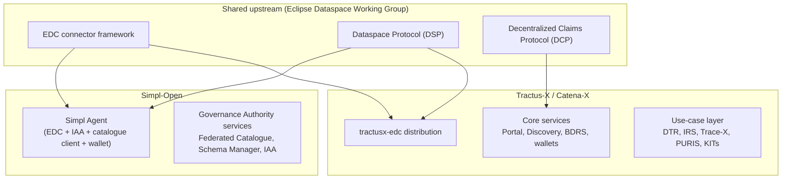

# Simpl-Open ↔ Eclipse Tractus-X / Catena-X comparison

> Technical comparison of **Simpl-Open** (the EC's sector-agnostic data-space middleware) with
> **Eclipse Tractus-X**, the open-source reference implementation of **Catena-X**, the automotive
> industry's operating data space.
>
> - **Simpl source:** the Functional and Technical Architecture Specifications (FTA), the
>   architecture repository on code.europa.eu, and programme knowledge current to July 2026.
> - **Tractus-X / Catena-X source:** eclipse-tractusx.github.io, the Tractus-X release changelog,
>   the Catena-X association's release-management and operating-model pages, and individual
>   component repositories, all checked July 2026.
> - Three names, three things: **Catena-X** is the data space (association, standards,
>   certification, operating companies). **Tractus-X** is the Eclipse project holding the open-source
>   code that implements it. **Simpl-Open** compares to *both at once*, which is exactly why the
>   comparison needs care.

---

## How to read this document

**The one-line framing.** Simpl-Open and Tractus-X overlap heavily in *technology* (both are
EDC-based, Dataspace-Protocol-speaking component toolboxes) but sit in different *categories*:
Simpl-Open is horizontal middleware you build a data space **on**, deliberately shipping no sector
functionality; Tractus-X is the toolbox of one specific vertical data space that has been **in
production since 2023**, wrapped in automotive semantics, certified business applications, and an
industry operating model. The technology comparison is Simpl-Open vs Tractus-X; the governance and
operating-model comparison is Simpl vs Catena-X.

Where a claim comes from a single meeting or mail rather than published architecture, the source is
named inline.

---

## 1. Profiles

| | Simpl-Open | Tractus-X / Catena-X |
|---|---|---|
| **What it is** | Sector-agnostic open-source middleware for data spaces and cloud-to-edge federations | Open-source toolbox (Tractus-X) implementing the automotive data space (Catena-X) |
| **Owner / driver** | European Commission, DG CONNECT | Catena-X Automotive Network e.V. (standards) + Eclipse Foundation (code); founded 2021 by BMW, Mercedes-Benz, Bosch, SAP, Siemens, ZF and others |
| **Delivery model** | EC procurement: SC-1 (build), SC-2 (use cases), SC-3 (infra/maintenance) | Eclipse open-source project ("Mature" status) + association working groups + commercial operating companies (Cofinity-X first) |
| **Licence** | EUPL-1.2 | Apache 2.0 (code), CC-BY-4.0 (non-code) |
| **Release model** | Programme milestones (full modular approach targeted end 2025; delivery deadline November 2026) | Quarterly CalVer releases (latest **26.06**, June 2026); the association bundles them into half-yearly planet-named **ecosystem releases** (live: **CX-Titan**; preview: **CX-Neptune**) with a one-year grace period |
| **Sector content** | None, by design | SAMM semantic models, about 80 CX standards, 41 KITs, certified business apps |
| **Production status** | Building toward full modularity; Simpl-Live wave 1 data spaces in implementation | Live since 2023: traceability, product carbon footprint, digital product passport, demand and capacity management, circular economy |

---

## 2. Shared foundations

The two stacks are cousins, not strangers. Both:

- build the connector on **EDC (Eclipse Dataspace Components)**. Tractus-X maintains
  `tractusx-edc`, a hardened distribution of upstream EDC with pre-built control/data-plane images,
  Helm charts, PostgreSQL persistence, Vault integration, and extensions such as BPN validation.
  Simpl embeds EDC inside its Agent with its own custom extensions. Improvements flow between the
  two through the **Eclipse Dataspace Working Group**, not directly.
- speak the **Dataspace Protocol (DSP)** for catalogue, contract negotiation, and transfer.
  `tractusx-edc` 0.12.x supports DSP **2025-1** alongside the older 0.8 version.
- express usage policies in **ODRL**.
- align with the Gaia-X / IDSA / DSSC family of European data-space initiatives.

DCP is in the shared box but only Tractus-X consumes it today; that asymmetry is the identity
divergence in section 3.1.

---

## 3. The four big divergences

### 3.1 Identity and trust: central authority vs self-sovereign identity

The deepest architectural fork.

| | Simpl-Open | Catena-X / Tractus-X |
|---|---|---|
| Trust anchor | **Governance Authority** issues tiered onboarding credentials (Tier 1 / Tier 2, X.509); Keycloak-based IAA; OID4VP in progress | **SSI**: verifiable credentials in participant wallets, exchanged connector-to-connector via **DCP** (Decentralized Claims Protocol, formerly IATP) |
| Participant identifier | GA-issued identity attributes | **BPN** (Business Partner Number), globally unique, issued by the operating company (Cofinity-X), resolved to DIDs via the **BDRS** (BPN-DID Resolution Service) |
| Wallet | Part of the Simpl Agent bundle | Managed Identity Wallet **archived January 2025**; interim reliance on commercial DIM wallets + SSI Credential Issuer; open-source **Identity Hub** ("Holder Wallet & Issuer Service") added as a product in release 26.03 |
| Inter-agent security | Tier 2 gateway / network proxy mediates all inter-agent communication | Credential presentation per DSP interaction; no mandated network intermediary |

Two observations worth carrying into any convergence discussion. First, Catena-X's own wallet story
has churned (MIW built, archived, replaced by commercial wallets, now re-opened as Identity Hub),
so "Tractus-X has SSI solved" overstates it. Second, Simpl's OID4VP work moves it toward verifiable
credentials too; the gap is narrowing from both sides, but today a Simpl Agent and a Tractus-X
connector could not complete each other's trust handshake.

### 3.2 Semantics: schema governance vs semantic models and digital twins

| | Simpl-Open | Catena-X / Tractus-X |
|---|---|---|
| Metadata contract | **Schema Manager**: GA-defined SHACL shapes + ontology fragments (Turtle), synced to every participant; Vocabulary Manager for ontologies | **SAMM** (Semantic Aspect Meta Model, CX-0003) aspect models, maintained in `sldt-semantic-models`, served by the **Semantic Hub** (also Jena Fuseki based, a nice symmetry with Simpl's schema-manager stack) |
| Data description unit | **Self-Description** validated against GA schemas | **Digital twin** (Asset Administration Shell) with SAMM submodels, registered in the **Digital Twin Registry** |
| Cataloguing standard | DCAT-AP migration planned; catalogue currently schema-agnostic (XFSC) | CX standards library (about 80 semver-versioned standards) prescribes models per use case |

Simpl standardises *how a data space defines its own schemas*; Catena-X standardises *the actual
automotive semantics*. That is the horizontal/vertical split showing up at the metadata layer.

### 3.3 Discovery: central federated catalogue vs decentralised discovery services

Simpl runs a **central Federated Catalogue** at the Governance Authority (XFSC + Neo4j): providers
publish signed Self-Descriptions, consumers search one place, policy-filtered.

Catena-X has **no central metadata catalogue**. Each participant's connector exposes its own DSP
catalogue; finding *whom to ask* is solved by a set of core services (Discovery Finder, BPN
Discovery, BDRS) plus the Digital Twin Registry for item-level lookup, and the **Portal** for
human-facing registration and app marketplace. The Item Relationship Service then walks
twin-to-twin references to reconstruct multi-tier supply chains, something Simpl has no equivalent
for (and, being use-case-specific, deliberately so).

### 3.4 Operating model: procurement vs association-plus-market

- **Simpl**: the EC procures the software; each data space that adopts it appoints a Governance
  Authority; there is no certification market. Business processes (BP03A onboarding, BP06
  catalogue, BP09 exchange, BP11/BP12 contracts, BP14 billing) are defined in the FTA.
- **Catena-X**: the association owns standards and a **Conformity Assessment Framework**; external
  certification bodies (e.g. TUV SUD, appointed 2025) certify apps and providers; commercial Core
  Service Providers operate the shared services under a defined CSP-A / CSP-B split (Cofinity-X
  the first); ecosystem releases give adopters a one-year upgrade grace period.

A June 2026 programme mail on contribution processes cites Catena-X (alongside EDC and openDesk)
as the **vendor-driven foundation** governance model, one of the candidate futures for Simpl's own
community governance. So Catena-X is not only a comparison object; it is one of the templates on
the table for how Simpl-Open itself could be governed.

---

## 4. Component mapping

| Capability | Simpl-Open | Tractus-X | Notes |
|---|---|---|---|
| Connector | EDC embedded in the Simpl Agent, custom extensions | `tractusx-edc` distribution | Same upstream; different extension sets and identity wiring |
| Onboarding / participant UI | GA onboarding (BP03A), Simpl UIs | **Portal** (+ portal-iam Keycloak) | Both Keycloak-adjacent at the edges |
| Catalogue / discovery | **Federated Catalogue** (central, XFSC + Neo4j) + Query Mapper Adapter | Per-connector DSP catalogues + **Discovery Services** + **BDRS** | Central vs decentralised, see 3.3 |
| Schema / semantics | **Schema Manager** + **Vocabulary Manager** (SHACL/TTL, Fuseki) | **Semantic Hub** + `sldt-semantic-models` (SAMM, Fuseki) | Closest architectural cousins in the whole mapping |
| Self-Descriptions | **SD Tooling** (creation wizard, SHACL validation, signing) | **SD-Factory** | Both produce signed Gaia-X-style self-descriptions |
| Digital twins | (none) | **Digital Twin Registry**, **Item Relationship Service** | Use-case layer Simpl deliberately does not ship |
| Identity / trust | **IAA** (Tier 1 / Tier 2, X.509, Keycloak, OID4VP WIP) | **Identity Hub**, **SSI Credential Issuer**, **BDRS**, BPN | Divergent models, see 3.1 |
| Business partner master data | (none) | **BPDM** golden-record service | |
| Policy authoring | ODRL policies in contract flow | **Policy Hub** (policy templates and rules) | |
| Contracts / billing | Contract management + billing components (BP11/BP12/BP14) | Contract negotiation in connector; billing left to operating companies / marketplace | Simpl treats billing as middleware; Catena-X treats it as market |
| Data processing / orchestration | **Orchestration Platform** (Dagster) + Asset Orchestrator | (none generic; per-app logic, Industry Core Hub for provision/consumption flows) | Simpl-specific strength |
| Notifications | Notification Service | (in-app, e.g. Trace-X quality notifications) | |
| Use-case applications | None, by design | **Trace-X**, **PURIS**, Digital Product Pass, 41 KITs | The category gap |
| Local evaluation | This repo (`simpl-local`) | **tractus-x-umbrella** Helm chart, **MXD** minimum extensible dataspace | See section 6 |

---

## 5. Relationship in practice

Not hypothetical: the programme already leans on Tractus-X in concrete places.

1. **Kafka streaming (R56).** Simpl's data-streaming architecture explicitly delegates design and
   implementation detail to the **Tractus-X EDC Kafka extension** and states the intent to "leverage
   the proven Tractus-X EDC Kafka extension... ensuring alignment with established data space
   initiatives". The architecture-review thread around it (April/May 2026) is also a caution: the
   Tractus-X pattern of a provider-managed broker outside the connector perimeter had to be
   reconciled with Simpl's mandatory Tier 2 proxy model (resolved as: broker outside the Simpl
   perimeter, Agent control-plane only, compensating controls to be specified).
2. **Reference model status.** In the same R56 discussion the delivery team states "the
   architecture aligns with the Tractus-X design and adopts it as the reference model" for
   streaming, while acknowledging maturity caveats.
3. **The template other sector spaces copy.** Emerging spaces that talk to Simpl are largely
   Catena-X-shaped: Decade-X / AerospaceX (aerospace, self-described as "a consortium like
   Catena-X") built its FrankieX connector from vanilla EDC plus Tractus-X and Eona-X extensions,
   and met Simpl in April 2026 about component reuse. Eclipse also positions Tractus-X as the
   reference implementation home for **Manufacturing-X**; Factory-X's connector builds directly on
   `tractusx-edc`. When Simpl federates with a sector space, the counterpart stack will very often
   be Tractus-X-derived.
4. **Governance federation, not code federation.** Catena-X predates Simpl and owns its stack; it
   will not build on Simpl. Both speak DSP, so protocol-level federation is possible in principle
   but undemonstrated, and the identity fork (3.1) is the real blocker. The realistic convergence
   path runs through the Eclipse Dataspace Working Group: shared EDC, shared DSP/DCP specs,
   extensions contributed upstream rather than cross-adopted.

The strategic fork for **future** sector data spaces: assemble a Catena-X-style stack from
Tractus-X parts (proven, automotive-flavoured, bring-your-own governance) or start from Simpl-Open
middleware (sector-neutral, GA governance included, younger).

---

## 6. Local evaluation: the simpl-local angle

Tractus-X has first-party answers to the question this repository exists for:

- **`tractus-x-umbrella`**: one Helm chart deploying a working Catena-X sandbox on any Kubernetes
  (Minikube recommended), with modular subsets (data exchange only, business partner management
  only, ...), used for E2E testing and component evaluation.
- **MXD** ("minimum extensible dataspace", in `tutorial-resources`): a Terraform-based two-connector
  starter dataspace for local experimentation.

Simpl-Open's integrated deployment (`common-deployer`) has no supported minimal profile, which is
why `simpl-local` builds per-component stacks by hand (and why proving component modularity is
worth a repo at all). The umbrella chart's "modular subsets" idea is the closest existing
realisation of what simpl-local argues Simpl-Open should offer natively. Differences in substrate:
umbrella/MXD assume Kubernetes + Helm/Terraform; simpl-local deliberately stays on Docker Compose.

---

## 7. Where each is genuinely stronger

**Simpl-Open**
- Sector-neutral by construction: nothing automotive to strip out before reuse.
- Governance Authority model and formal BP catalogue ship with the middleware; a new data space
  does not need to invent an association, certification framework, or operating company first.
- Generic data-processing orchestration (Dagster platform) and infrastructure/cloud-to-edge scope
  beyond pure data exchange.
- Single-owner procurement gives one accountable roadmap (and one licence, EUPL-1.2).

**Tractus-X / Catena-X**
- Production evidence since 2023 at automotive-supply-chain scale; quarterly releases with
  disciplined E2E testing; a real certification and operator market.
- Rich, versioned semantic layer (SAMM, AAS, CX standards) and a use-case application shelf
  (traceability, PCF, DPP) that Simpl intentionally lacks.
- SSI/DCP identity aligned with where the wider EDC ecosystem is heading.
- First-party local-evaluation tooling (umbrella, MXD).

And the caveats cut both ways: Catena-X's wallet churn shows production status does not mean
architectural stability, while Simpl's identity stack is mature precisely because it is the more
conservative, centralised design.

---

## 8. Sources and method

**Simpl side** (knowledge base, programme documents):
- FTA component inventory and business-process catalogue (`foundations/architecture`, code.europa.eu).
- R56 Data Streaming architecture note and review thread (May 2026).
- Decade-X / Airbus exchange meeting notes (April 2026).
- Programme mail on contribution processes and governance models (June 2026).
- Simpl-Open vs Catena-X Q&A note (July 2026); Prometheus-X vs Simpl comparison (June 2026, framing).

**Tractus-X / Catena-X side** (checked July 2026):
- Products and KITs: https://eclipse-tractusx.github.io/community/products/ , https://eclipse-tractusx.github.io/Kits
- Release changelog: https://github.com/eclipse-tractusx/tractus-x-release
- Ecosystem releases and operating model: https://catenax-ev.github.io/release-management , https://catenax-ev.github.io/docs/next/operating-model/what-service-map
- Standards library: https://catenax-ev.github.io/docs/next/standards/overview
- Connector: https://github.com/eclipse-tractusx/tractusx-edc ; Kafka extension: https://github.com/eclipse-tractusx/tractusx-edc-kafka-extension
- Identity: https://github.com/eclipse-tractusx/managed-identity-wallet (archived), https://github.com/eclipse-tractusx/ssi-credential-issuer , DCP 1.0.0 at projects.eclipse.org
- Local evaluation: https://github.com/eclipse-tractusx/tractus-x-umbrella , https://github.com/eclipse-tractusx/tutorial-resources
- Eclipse project record: https://projects.eclipse.org/projects/automotive.tractusx

Facts not verifiable on a fetched page are attributed inline to their knowledge-base source and
dated. Catena-X production-use claims reflect association publications, not independent audit.
