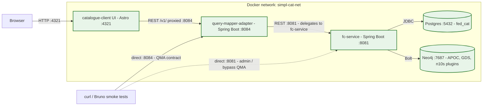
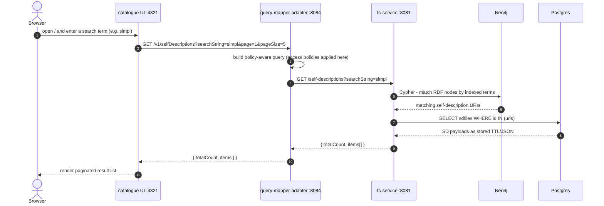
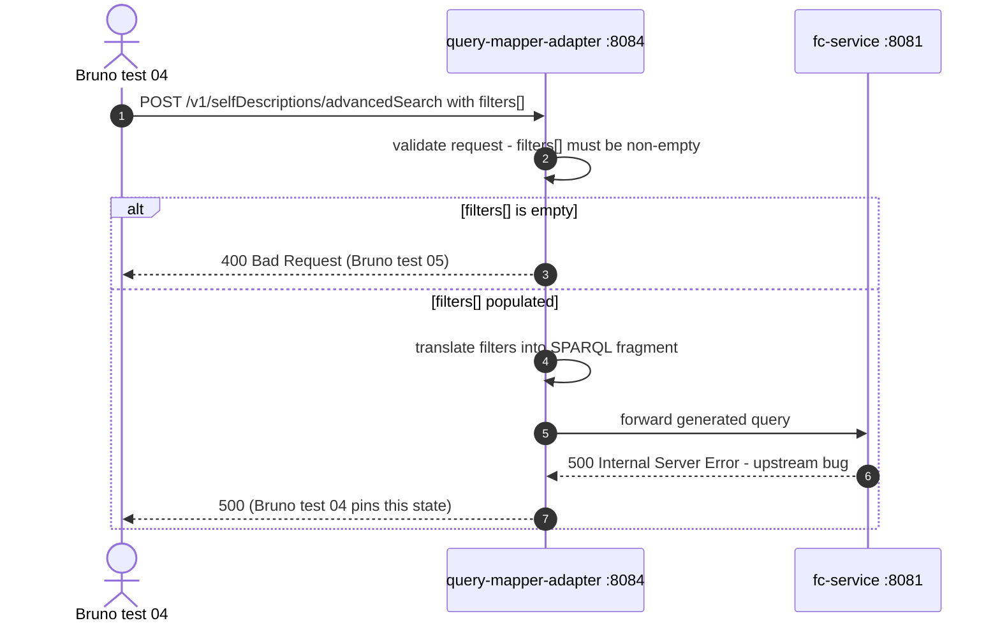

# Catalogue stack — architecture overview

An integrative view of the three SIMPL catalogue components running in this local
stack: the `fc-service` backend, the `query-mapper-adapter` (QMA), and the
`catalogue-client` UI. Each component has its own per-component doc covering
internal details, env-var configuration, and process model — this doc is the
above-the-component view: how they fit together, who calls whom, and what flows
across the wire.

For the per-component deep dives, see:

- [`fc-service-architecture.md`](fc-service-architecture.md) — backend, persistence, schema loading
- [`query-mapper-adapter-architecture.md`](query-mapper-adapter-architecture.md) — search proxy, policy filtering, advanced-search translation
- [`catalogue-ui-architecture.md`](catalogue-ui-architecture.md) — Astro UI, browser/runtime config, page routing

## At a glance

All five containers run on a single bridge network (`simpl-cat-net`). External
clients can reach all three application services on their host-mapped ports;
internal traffic uses Docker hostnames (`fc-service:8081`, `query-mapper-adapter:8084`,
etc.). Postgres and Neo4j are exposed on the host as `:5432` and `:7474/:7687` for
inspection only — the UI and QMA never connect to them directly.

## Sequence — quick search (browser to result list)

This is the path Bruno tests
[`02-fc-service-self-descriptions-list.bru`](../bruno/02-fc-service-self-descriptions-list.bru)
and [`03-qma-quick-search.bru`](../bruno/03-qma-quick-search.bru) exercise — both
returning the same response shape, one bypassing QMA (direct to fc-service) and the
other through the production path.

## Sequence — advanced search (currently pinned as failing)

The non-empty path currently returns 500 from the upstream — Bruno test 04 pins this
deliberately so a future fix is detected (the test name reads "advanced search
currently returns 500 (upstream bug, pinned)"). Treat the advanced-search endpoint
as known-broken at this stack's pinned upstream commit.

## Component responsibilities

| Component | Role | Talks to | Bruno coverage |
|---|---|---|---|
| `catalogue-client` UI | Browser-facing Astro/Vue app. Generates form fields from schemas. Calls QMA for searches. | QMA only | Not directly tested by Bruno (UI is exercised manually) |
| `query-mapper-adapter` | Policy-aware façade in front of fc-service. Applies access policies; translates advanced-search filters into SPARQL; forwards quick search verbatim. | fc-service | Tests 03, 04, 05 |
| `fc-service` | Federated Catalogue backend. Owns the canonical store: SD payloads in Postgres, RDF graph in Neo4j. Loads schemas (ontologies + SHACL shapes) into the graph; performs syntactic + semantic + quality validation on SD publication. | Postgres, Neo4j; optional external trust anchors | Tests 01, 02, 06 |
| `postgres` | SD payloads (`sdfiles`), schema files (`schemafiles`), validator caches, Liquibase migrations | — | — |
| `neo4j` | RDF graph parsed from each SD (via the `n10s` plugin), schema graphs, GDS algorithms for search ranking | — | — |

## Where data lives

| Data | Store | Why this store |
|---|---|---|
| Self-description payloads (TTL / JSON-LD as ingested) | Postgres `sdfiles` | Document-shaped, queried by id |
| Schemas / ontologies / SHACL shapes | Postgres `schemafiles` + Neo4j RDF graph | Postgres for the file as authored; Neo4j for graph-shaped queries via n10s |
| Parsed self-description graphs | Neo4j (one subgraph per SD, namespace-scoped) | Enables semantic search, traversal, GDS algorithms |
| Validator caches | Postgres `validatorcache` | Avoids re-parsing schemas on every SD validation |
| Liquibase migration history | Postgres | Tracks DDL/seed evolution across upstream versions |
| User / participant identity | Not stored locally | Production gets identity from Keycloak via the Tier-1 gateway; locally there is no auth surface |

## Known upstream limitations (pinned by Bruno tests)

| Test | Endpoint | Status pinned | Why |
|---|---|---|---|
| `04-qma-advanced-search.bru` | `POST /v1/selfDescriptions/advancedSearch` (populated filters) | 500 | Upstream advanced-search SPARQL translation produces an invalid query. Awaiting upstream fix. |
| `06-fc-service-participants-501.bru` | `GET /participants` | 501 Not Implemented | Endpoint family was disabled when Keycloak was removed from the upstream architecture. Deliberate; not a regression. |

These tests are not failures — they are *contract pins*. If the upstream changes
behaviour (e.g. advanced search starts returning 200, or `/participants` returns
something different), the test fails and we know to update both the test and our
documentation.

## Production vs. local

| Concern | Production | Local (this stack) |
|---|---|---|
| Auth | Keycloak → Tier-1 → Tier-2 → fc-service / QMA | None — fc-service and QMA both listen directly on their ports with no gateway |
| Schema source | Schema Management Service synchronises schemas from the Governance Authority via the Schema Synch Service | `seed.sh` uploads a fixed set of schemas (Simpl ontology + a SHACL shape) into fc-service at boot |
| `/participants` and `/users` endpoints | Backed by Keycloak | Return 501 (endpoint family disabled when Keycloak was removed) |
| Access policy enforcement | QMA applies access policies based on the caller's tokens | QMA's policy filter is in the request path but has no caller identity to evaluate against — effectively a no-op |
| External DID resolution (during SD verification) | `uniresolver.io` | Same in local stack, on-demand only when an SD references a DID |
| External Gaia-X trust anchor | `registry.lab.gaia-x.eu` (scheduled fetch) | Same in local stack — fc-service fails gracefully if unreachable |
| Postgres | Managed Postgres with PITR | `postgres:14` single container, host-mounted volume |
| Neo4j | Managed Neo4j with HA | `neo4j:5.14.0` single container with APOC, GDS, n10s plugins |
| UI runtime config | Build-time and runtime env vars injected by Helm | `extra_hosts: ["localhost:host-gateway"]` so the containerised UI can reach `localhost:*` ports the way a browser would (see `catalogue-ui-architecture.md` for the full networking trick) |
| Advanced search | Backed by `xfsc-advsearch-be` in production (not deployed locally) | QMA's local advanced-search path returns 500 due to the SPARQL translation bug; the full xFSC backend is out of scope for this stack |
| Image source | Pre-built JARs and Astro builds from GitLab CI | Source-built via per-component multi-stage Dockerfiles |
| Version | Set by GitLab CI pipeline | `PROJECT_RELEASE_VERSION=local` for the Spring Boot services; UI built fresh |

## See also

- Per-component deep dives in this folder: [fc-service](fc-service-architecture.md),
  [query-mapper-adapter](query-mapper-adapter-architecture.md), [catalogue UI](catalogue-ui-architecture.md)
- Bruno smoke tests for the cross-component flows: [`../bruno/`](../bruno/)
- Top-level monorepo overview: [`../../README.md`](../../README.md)
- Upstream documentation (each component's own README in
  `gaia-x-edc/simpl-fc-service`, `gaia-x-edc/simpl-catalogue-client`, and
  `gaia-x-edc/poc-gaia-edc` on `code.europa.eu/simpl`)
