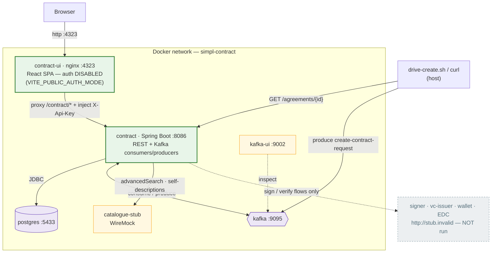
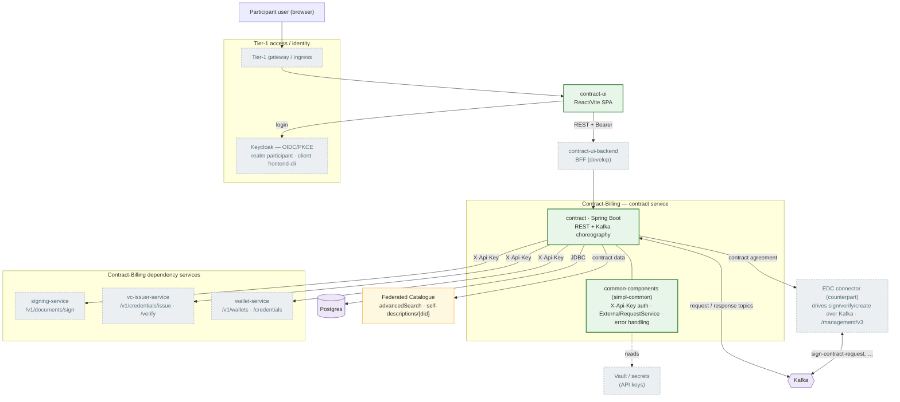

# Contract component — architecture description (local stack)

Scope: the Contract component of the Simpl-Open **Contract-Billing** concern, as
deployed by this local stack. Describes what the two artefacts are, how they
depend on their environment, and where the integration boundary currently lies.

---

## 1. Context

The Contract component implements the runtime side of **contract establishment
and lifecycle** between data-space participants (R17 family). It extends the
EDC-mediated contract negotiation with:

- **storage / consultation / update** of signed contracts,
- additional **negotiation steps** in establishment,
- **monitoring and enforcement** of contract-defined resource usage, including
  triggering **contract closure** and **resource decommissioning**.

It is a participant-side service: this stack runs it in `MODE=PROVIDER`
(the data-provider role); the same image runs as `CONSUMER` elsewhere.

### 1a. Local stack — as built (dependencies stripped)

What this stack actually runs. Real dependencies (signer, vc-issuer, wallet, EDC
connector, Keycloak) are **not** present — they are replaced by an inert URL, a
WireMock catalogue, or removed (auth disabled). This is the modularity-proof
footprint: the backend boots and serves on **Postgres + Kafka alone**.

### 1b. Full topology — all dependencies

The real production picture the component assumes. Node colour shows how each
piece is handled in the local stack (legend below).

**Legend / local-stack status**

| Colour | Meaning | In this stack |
|---|---|---|
| 🟩 green | runs for real | `contract` backend (+`simpl-common` bundled in the jar), `contract-ui` (+ overlay), Postgres, Kafka |
| 🟨 amber | stubbed | Federated Catalogue → WireMock `catalogue-stub`; Kafka-UI is a viewer |
| ⬜ grey (dashed) | absent / bypassed | Keycloak + Tier-1 gateway (auth disabled; nginx stands in), signer / vc-issuer / wallet / EDC connector (not run → `stub.invalid`), `contract-ui-backend` (not run), Vault (API key via env) |

> The `contract-ui → contract` read path **is** implemented in this stack (via
> `ui-overlay/`); the create/sign **write** path is not — it needs the grey
> services above. See §5.

---

## 2. Artefacts

| Artefact | Type | Stack | Notes |
|---|---|---|---|
| `contract` | Backend microservice | Spring Boot / Java 21: WebFlux (reactive REST), Spring Data JPA, Spring Kafka, Liquibase, Actuator | OpenAPI at `openapi/openapi3-v1.yaml`; REST + Kafka dual interface |
| `contract-ui` | Front-end SPA | React 19, Vite, TypeScript, react-router, react-hook-form | Feature-sliced (`app/ auth/ entities/ pages/ shared/`); Keycloak OIDC/PKCE |

Layered backend packages: `controller / service / repository / entity / mapper /
producer / consumer / kafka / events / config / transfer(dto)`.

---

## 3. Runtime dependencies

| Dependency | Needed for | In this stack |
|---|---|---|
| **Postgres** | **Boot** — Liquibase migrations + db health probe | `postgres:16` (`contract`/`contract`) |
| **Kafka** (SASL_PLAINTEXT/PLAIN) | **Boot** — consumer/producer for ~20 topics | `bitnami/kafka` with SASL |
| Signer service | Sign flow | inert stub URL |
| VC-issuer | Credential issuance | inert stub URL |
| EDC connector / contract-agreement | Negotiation flow | inert stub URL (wire `simpl-edc` to enable) |
| Catalogue (search / get) | Search flow | inert stub URL |
| Keycloak | UI login | remote dev sandbox (UI only) |

**Boot-critical = Postgres + Kafka.** Health (`/contract/v1/health`) checks only
diskspace + db, so the service reports UP without the per-request external
services. Those are invoked only on their respective flows.

### Profile choice

The stack runs the **`default`** profile (`application.yaml`), which is fully
environment-variable driven, and supplies every variable from compose.
`application-local.yaml` is **not** used: it hardcodes `localhost:*` endpoints
that only resolve for a jar run directly on the host, not inside the container
network.

---

## 4. Kafka topic map

Request/response pairs, each with a dead-letter topic (`-dlt`):

| Domain action | Request | Response |
|---|---|---|
| Create contract | `create-contract-request` | `create-contract-response` |
| Sign contract | `sign-contract-req` | `sign-contract-resp` |
| Search contract | `search-contract-request` | `search-contract-response` |
| Verification | `verification-request` | `verification-response` |
| Status update | `status-update` | — |

The service is therefore an **event-driven participant** as well as a REST
service: contract establishment is driven over Kafka (the EDC/connector side),
while query/admin operations are REST.

---

## 5. The integration boundary (current gap)

The UI does **not** talk to the backend yet:

- `shared/api/httpClient.ts` is defined but **never imported/called**;
- there is **no contract API base URL** in the code or `.env`;
- `entities/contract/types.ts` models a contract as `{ id: string }` only;
- `pages/ContractViewPage` is a 20-line shell.

The UI's only outbound dependency is **Keycloak** (login). The artefact is, in
effect, a generic React/Keycloak shell cloned from the Monitoring/Catalogue
front-ends (residual `monitoring-reporting-fe` name, `kbn-xsrf` header,
hardcoded `catalogue-ui…uat` redirect), not yet specialised to contracts.

**Consequence for acceptance:** there is no per-component evidence of a working
contract UI; the front-end exists as scaffolding only. This stack makes that
visible — the backend is exercisable via OpenAPI/curl; the UI renders but cannot
demonstrate a contract flow.

The local nginx already reverse-proxies `/contract/*` to the backend, so the
moment the UI gains an API base URL + calls, the bundle becomes end-to-end with
no stack change.

---

## 6. What a fuller local bring-up would add

1. An **EDC connector** (reuse `simpl-local/simpl-edc`) on `EDC_URL`/`STUBS_URL`
   to drive negotiation/establishment.
2. **Signer** + **VC-issuer** stubs for the sign/issue path.
3. **Catalogue** stubs (or the `simpl-catalogue` stack) for search/get.
4. A second `contract` instance in `CONSUMER` mode for a two-participant flow
   (mirrors the two-agent `simpl-edc` pattern).
