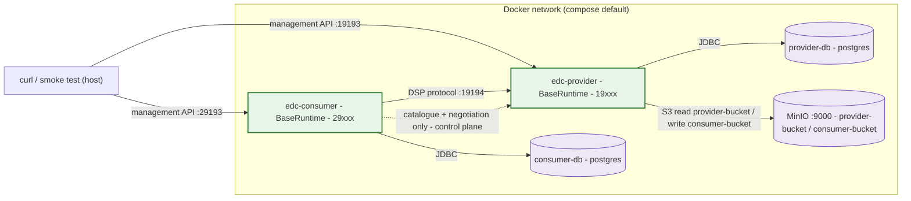
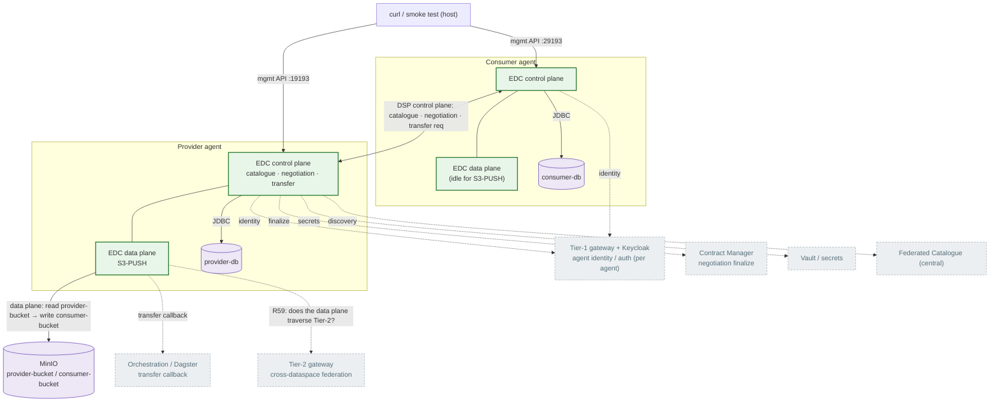
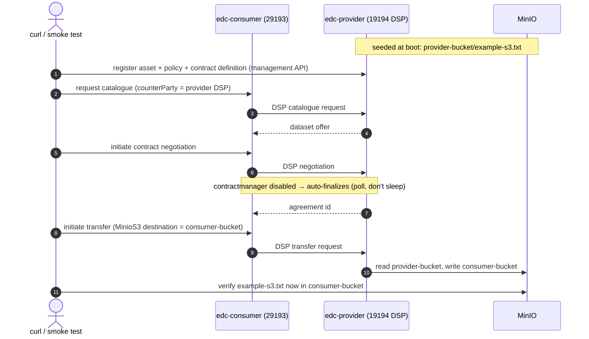

# EDC two-agent stack — design doc (pre-build)

> **Status: DESIGN, not yet built.** This is the wiring plan for a local
> provider↔consumer EDC stack, written for review before any code is committed.
> Numbers and config keys are taken from the upstream `simpl-edc` repo
> (`development/gaia-x-edc/simpl-edc`, `docker/` + `local/`) as of 2026-06-13.

## Why this stack is different

Every existing simpl-local stack proves one component runs **in isolation**.
The EDC connector can't be evaluated that way — it does nothing without a peer.
So this stack proves the next claim up: **two Simpl agents actually completing a
DSP exchange** (catalogue → contract negotiation → data transfer). That is the
shape of cross-dataspace consumption (R59) and the S3-PUSH data-plane (the
`MinioS3` transfer path), made observable on one machine.

## Why it's feasible without the heavy dependencies

The upstream `local/` config already bypasses or disables everything that would
otherwise make this hard. We inherit those bypasses rather than inventing them:

| Dependency | Production | Local (already in upstream config) |
|---|---|---|
| IAA / Keycloak / Tier-1 | Connector calls `client.authenticationprovider.url` (Tier-1) for identity attributes | **Mocked**: `mocked.agent.identity.attributes` is a hardcoded base64 blob parsed by `SimplIdentityService` / `IamExtension`; the real Tier-1 URL is commented out. Marked "use only for local development". |
| Contract manager | `contractmanager.extension.enabled=true`, calls a contract-manager service during negotiation | **Disabled**: `contractmanager.extension.enabled=false` → negotiation auto-finalizes after a few seconds. No mock, no manual curl. |
| HashiCorp Vault | Vault stores connector secrets | **Not wired**: pom uses `configuration-filesystem`; no Vault dependency or source reference. EDC falls back to its in-memory vault. The `VAULT_*` vars in `docker/.env` are vestigial (helm path). |
| Orchestration (Dagster) | `transfer.extension.enabled=true` fires a post-transfer webhook at the orchestration platform | **Set to `false`** for this stack — the S3→S3 transfer itself is unaffected; this only drops the Dagster callback, keeping the stack independent of `simpl-orchestration`. |

Net: the only real infrastructure is **2× Postgres + MinIO + 2× the connector**.
This mirrors the schema-manager / vocabulary-manager pattern — the auth machinery
is bypassed by a mechanism the upstream code already provides for local dev.

> **Note on the contract-manager mock.** The upstream `docker-compose.yml`
> references `…/simpl-contract-negotiation-mockup:1.0.0` from the GitLab
> container registry, which is **not anonymously pullable** (registry returns
> 401). Because we set `contractmanager.extension.enabled=false`, this stack
> drops both mock services entirely and never needs that image.

## Topology

Solid green = the two connector agents (same image, different mounted config).
Purple = stateful backing stores. The **control plane** (catalogue request,
contract negotiation, transfer request) is connector→connector over DSP on the
provider's `:19194/protocol`. The **data plane** for an S3-PUSH is
connector→MinIO: the provider's embedded data plane reads `provider-bucket` and
writes `consumer-bucket` — the bytes do **not** flow consumer↔provider. (Making
that distinction visible is one of the things this stack is for — see R59 below.)

### Full topology — all dependencies

The production picture a real Simpl agent EDC assumes. This stack runs only the
green/purple nodes; everything grey is **stripped** (replaced by upstream's own
local-dev bypass config, not invented here). The dashed **Tier-2 gateway** edge
is drawn deliberately to pin the open R59 question.

**Legend / local-stack status**

| Colour | Meaning | In this stack |
|---|---|---|
| 🟩 green | runs for real | both agents' EDC control + data planes (one image, mounted provider/consumer config) |
| 🟪 purple | stateful store | provider-db, consumer-db, MinIO |
| ⬜ grey (dashed) | absent / bypassed (upstream local-dev config) | Tier-1 gateway + Keycloak (mocked `agent.identity.attributes`), Contract Manager (`contractmanager.extension.enabled=false` → auto-finalize), Vault (in-memory / `configuration-filesystem`), Orchestration/Dagster (`transfer.extension.enabled=false`), Federated Catalogue (each connector serves its own DSP catalogue), **Tier-2 gateway (not modelled)** |

> **R59 framing:** the stack makes the **control plane** (connector↔connector DSP)
> and the **data plane** (connector→MinIO bytes) separately observable, but it does
> **not** stand up the Tier-2 gateway — so the question *"does the data plane
> traverse the Tier-2 gateway, or only the control plane?"* is drawn but not yet
> answered. Adding T2 to the topology is the next step if you want to settle it
> empirically.

## Ports

From `docker/.env` (kept as-is; none clash with other stacks, which use
808x/30xx/43xx — see the MinIO console caveat below):

| Role | HTTP/api | Management | DSP protocol | Public (dataplane) | Control | DB (host) |
|---|---|---|---|---|---|---|
| Provider | 19191 | 19193 | 19194 | 19291 | 19192 | 5432 |
| Consumer | 29191 | 29193 | 29194 | 29291 | 29192 | 5433 |
| MinIO | API 9000 | Console 9001 → **remap to 9090** | | | | |

> **MinIO console (9001) clashes** with the schema-manager stack's Kafka UI
> (also 9001). Stacks are normally run one at a time, but to be safe the design
> remaps the MinIO console to **9090** in this stack's compose. The MinIO S3 API
> stays on 9000.

## The core work: localhost → service-name wiring

The upstream `local/*-config.properties` are written for the IntelliJ host-JVM
workflow, so they hardcode `localhost` everywhere. Containerizing means the two
connectors must address each other and their backing stores by **compose service
name**. This rewiring is the bulk of the effort. The transformation:

| Config key (provider example) | Upstream value | Containerized value |
|---|---|---|
| `edc.datasource.default.url` | `jdbc:postgresql://localhost:5432/postgres` | `jdbc:postgresql://provider-db:5432/postgres` |
| `edc.datasource.policy.url` | `…localhost:5432…` | `…provider-db:5432…` |
| `edc.dsp.callback.address` | `http://localhost:19194/protocol` | `http://edc-provider:19194/protocol` |
| `edc.dataplane.api.public.baseurl` | `http://localhost:19291/public` | `http://edc-provider:19291/public` |
| `edc.dataplane.token.validation.endpoint` | `http://localhost:19191/api/v1/validation/token` | `http://edc-provider:19191/api/v1/validation/token` |
| `fr.gxfs.s3.endpoint` | `http://localhost:9000` | `http://minio:9000` |
| (consumer→provider) `counterPartyAddress` in API calls | `http://localhost:19194/protocol` | `http://edc-provider:19194/protocol` |

The upstream `local/README.MD` confirms the last row explicitly: "to run it on
docker only, `counterPartyAddress` … should be changed to
`http://provider:19194/protocol`." That single hint is the tell that the rest of
the addresses need the same treatment — and the area to verify carefully during
build is the **data-plane public address + token-validation endpoint**, since
those are advertised by one connector for the other to call back.

## Build approach (house style)

Multi-stage `Dockerfile.local`:
- **Stage 1** — Maven (**Java 21** — see build outcomes), `mvn -DskipTests
  package` with `PROJECT_RELEASE_VERSION` set, produces the `BaseRuntime` fat jar
  (`pom.xml` artifactId `simpledc`, finalName `basic-connector`, main class
  `org.eclipse.edc.boot.system.runtime.BaseRuntime`). No host Java/Maven.
- **Stage 2** — Java 21 JRE, `ENTRYPOINT java -Dedc.fs.config=/config/connector.properties -jar …`.

One image, two services (`edc-provider`, `edc-consumer`), each mounting its own
config file. EDC selects provider vs consumer purely from the mounted config —
no per-role build. (First build is heavy: EDC pulls a large Maven tree, ~10 min,
sizeable image — one-time.)

## Demo flow the `start.sh` will drive

Smoke-test assertion = the file lands in `consumer-bucket`. Because negotiation
auto-finalizes asynchronously, the script must **poll the negotiation/transfer
state with a timeout**, not sleep a fixed interval.

## What it proves (ties to active work)

- **R59 (cross-dataspace consumption)** — you flagged "does the data plane
  traverse the Tier-2 gateways?" as the load-bearing ambiguity. Here the data
  plane is connector→MinIO and the control plane is connector→connector; watching
  the two paths separately is the empirical version of that question.
- **S3-PUSH data-plane conformance** — this stack *is* the `MinioS3` push path;
  your conformance claims become demonstrable rather than spec-argued.
- **OSS-externalisation ADR (category 3)** — `simpl-edc` is a maintained fork.
  Running it locally is hands-on backing for "a fork we maintain is our code,
  not an external prerequisite."
- **Modularity thesis** — first stack proving *two agents exchanging*, not one
  isolated service.

## Risks / open questions to resolve during build

1. **Data-plane public addressing** (highest) — verify the provider's advertised
   `edc.dataplane.api.public.baseurl` and `token.validation.endpoint` are
   reachable by the consumer under the container hostnames; S3-PUSH may exercise
   these less than HTTP-pull, but they must hold valid service-name values.
2. **Auto-finalize timing** — poll-with-timeout in the smoke test, not a fixed
   sleep.
3. **Build weight** — one-time ~10 min first build, large image.
4. **Asset/policy/contract-definition seeding** — the management-API calls that
   register the provider's asset+policy+contract-definition need to be scripted
   (the upstream repo has request bodies in its root README / Postman to crib
   from); confirm the `MinioS3` data-address shape for both source and
   destination.
5. **Does the embedded data plane need the public port at all for S3-PUSH?** —
   determines whether `:19291/:29291` must be exposed or can be internal-only.

## Effort

~1 day, vs a few hours for the leaf stacks — almost all of it in risk #1/#4
(container-to-container DSP + data-plane wiring and the seed script), since this
is the first two-agent stack. Everything heavy (IAA, Vault, contract-manager,
Dagster) is already bypassed by upstream local config, so there is no auth
infrastructure to stand up.

## Build outcomes (verified 2026-06-13)

Built and ran end to end. The risk register held up — the container-to-container
DSP + data-plane wiring (risk #1) worked as designed: catalogue, negotiation
(FINALIZED), and `MinioS3-PUSH` transfer (COMPLETED) all succeeded, with
`example-s3.txt` landing in `consumer-bucket`. Three things surfaced during the
build that weren't visible from the config alone:

1. **`PROJECT_RELEASE_VERSION` required.** The pom version is
   `${env.PROJECT_RELEASE_VERSION}`; Maven refuses to build without it. Set as an
   `ENV` in the build stage (same pattern as the vocabulary-manager stack).
2. **Java 21, not 17.** The pom targets 17, but the vendored Gaia-X MinIO S3
   extension (`libs/*.jar` → `fr.gxfs.edc.extension.s3`) is compiled for Java 21.
   A 17 runtime boots every other extension then dies with
   `UnsupportedClassVersionError` (class file 65.0 vs 61.0). Both Dockerfile
   stages use Java 21.
3. **Readiness probe.** EDC has no `GET /management/v3/assets`; the list endpoint
   is `POST /management/v3/assets/request` (returns `[]`, 200). The `start.sh`
   health gate uses that.

The actual first build was ~2 min (not the estimated ~10) on a warm Docker
cache; cold it will be longer but the EDC tree was smaller than feared.
