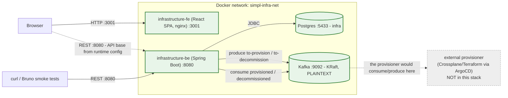
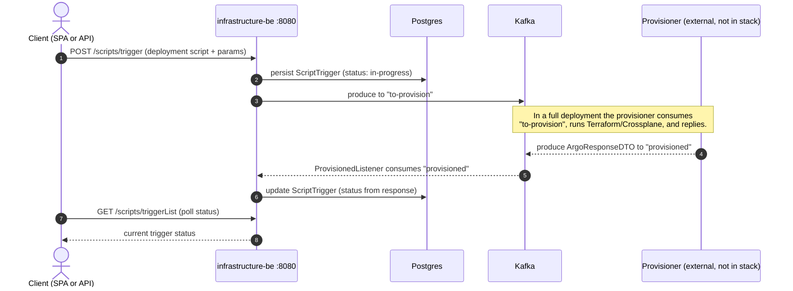
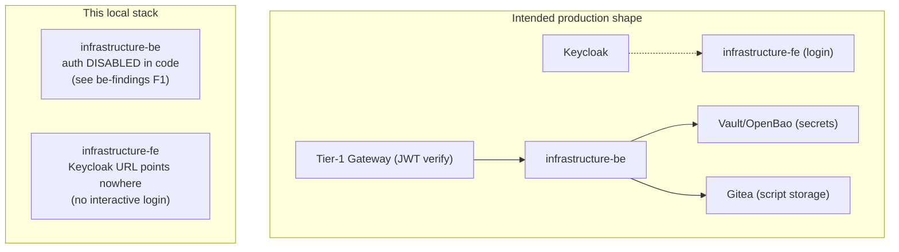

# Infrastructure stack: architecture overview

An integrative view of the two SIMPL infrastructure-provisioning components in this
local stack: the `infrastructure-be` backend (Spring Boot, artifact `script-service`)
and the `infrastructure-fe` React SPA, plus the infra they depend on (Postgres and a
single-node Kafka). This is the above-the-component view: how they fit together, who
calls whom, and what crosses the wire. For per-component internals see:

- [`infrastructure-be-architecture.md`](infrastructure-be-architecture.md): backend, persistence, Kafka topics, config keys
- [`infrastructure-fe-architecture.md`](infrastructure-fe-architecture.md): SPA, nginx, auth flow, runtime config

## What the component does

The infrastructure-provisioning capability lets a Simpl Infrastructure Provider
offer cloud resources (VM, Kubernetes, PaaS) that a Consumer provisions on demand.
The backend stores **deployment scripts**, **cloud provisioner templates** and
**cloud environments**, and drives provisioning by exchanging request/response
messages over Kafka with an **external provisioner** (Crossplane/Terraform run via
ArgoCD, in the separate `infrastructure-crossplane` / `infrastructure-provisioner`
repos). The backend itself runs no Terraform: it is the requester/record side; the
provisioner is the executor side.

## At a glance

All four containers run on a single bridge network (`simpl-infra-net`). The SPA is
served by nginx on the host at `:3001`; because it runs in the browser, its API
calls go to the host-mapped backend port `:8080`, not to a Docker hostname.
Postgres (`:5433`) and Kafka (`:9092`) are exposed on the host for inspection.

## Provisioning message flow (request and response)

The backend never talks to a cloud provider directly. `POST /scripts/trigger`
publishes a request and the provisioner (out of this stack) fulfils it and replies.

In this local stack there is no provisioner, so `to-provision` messages are not
fulfilled. `seed.sh` and the Bruno collection instead inject a response directly
onto the `provisioned` topic to exercise the consume path.

## Kafka topics

| Topic | Direction (from BE) | Purpose |
|---|---|---|
| `to-provision` | produce | provisioning request to the provisioner |
| `provisioned` | consume | provisioning result (`ArgoResponseDTO`) |
| `to-decommission` | produce | decommission request |
| `decommissioned` | consume | decommission result |
| `notifications` | produce | user notifications |

## Trust boundaries and what is omitted

Omitted on purpose: **Keycloak/Tier-1 gateway** (the backend disables auth in code,
so no token is needed; the SPA needs a Keycloak only for an interactive login),
**Vault/OpenBao** (`VaultServiceImpl` is lazy; dummy env satisfies bean binding),
**Gitea** (only exercised by script-content operations), **mailer**, and the
**ArgoCD/Crossplane provisioner** (the separate executor side). This is a
component-in-isolation stack: governance evidence that the backend runs without
ArgoCD as a prerequisite.

Consequence worth noting: because the backend has authentication disabled and the
SPA's role gate is client-side only, the role/authorisation model is currently not
enforced end to end (see `be-findings.md` F1 and `fe-findings.md` F-FE-3).
