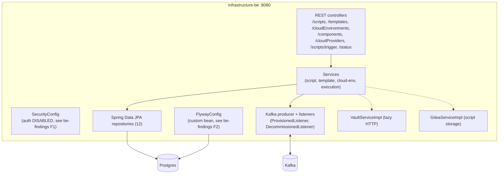

# infrastructure-be: component architecture

Spring Boot 3.4 / Java 21 service (artifact `script-service`), the record and
requester side of infrastructure provisioning. Packaged as a single fat jar
(`infrastructure-be.jar`, ~133 MB), served on `:8080`.

## Internal structure

## Persistence

- Postgres, schema owned by **Flyway** (50 migrations, `classpath:db/migration`).
  Seeds cloud providers (Ionos/Aruba/Ovh) and script types (VM, KUBERNETES, PAAS,
  VM_APP).
- 12 JPA repositories. In the shipped `docker` profile `ddl-auto=none` (Flyway is
  authoritative); the `local` profile intends `ddl-auto=update` but does not start
  as shipped (see be-findings F2).

## Messaging

`@KafkaListener` on `provisioned` and `decommissioned`; producer to `to-provision`,
`to-decommission`, `notifications`. Consumer group `group-1`, manual ack
(`enable-auto-commit=false`). No dead-letter or custom error handler is configured
(be-findings F3). SASL is on by default upstream; this stack disables it
(`kafka.sasl.enabled=false`).

## Configuration keys that matter for boot

`@Value` keys with **no default** that fail the context if unset: `spring.datasource.*`
(local: `LOCAL_DB_*`), `infrastructure.api.config.value`, `gitea.url/user/token`,
`participant.token.user/password`, `vault.token/url` (local: `LOCAL_VAULT_TOKEN`,
`LOCAL_URL`), `spring.mail.*` (local: `LOCAL_SPRING_MAIL_*`). `PROJECT_RELEASE_VERSION`
is required at **build** time (the pom `<version>` reads it from the environment).

Lazy dependencies (bind at startup, connect only when used): Vault (only on
`storeDataInVault`), mailer, Gitea. Kafka connects when the listener container
starts; a plain broker with SASL off is enough for the local stack.

## Security posture (as shipped)

`SecurityConfig` sets `anyRequest().permitAll()` and `oauth2ResourceServer().disable()`,
with a code comment that auth is "temporarily disabled until alignment between the
Infra and TSI teams". CSRF is disabled on the same basis. A configured
malicious-content regex blocklist exists but is wired to nothing. See `be-findings.md`
F1 and F4.

## Endpoints (v1)

`GET /status` and the Swagger/OpenAPI paths are on the public allowlist; every other
endpoint is reachable without a token in the current build. Groups: `/scripts`
(+ `/types`, `/trigger`, `/triggerList`, `/metadata`, `/{id}/copy`, `/{id}/configFiles`),
`/templates`, `/cloudEnvironments`, `/cloudProviders`, `/cloudProvisionerTemplates`,
`/components`, `/requesters`.
