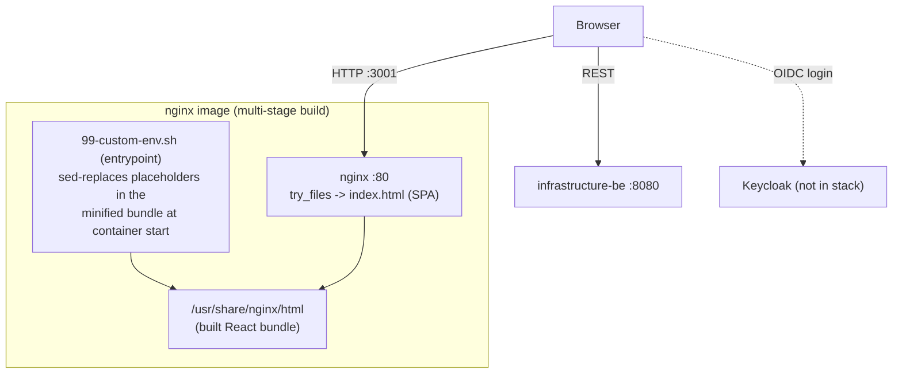
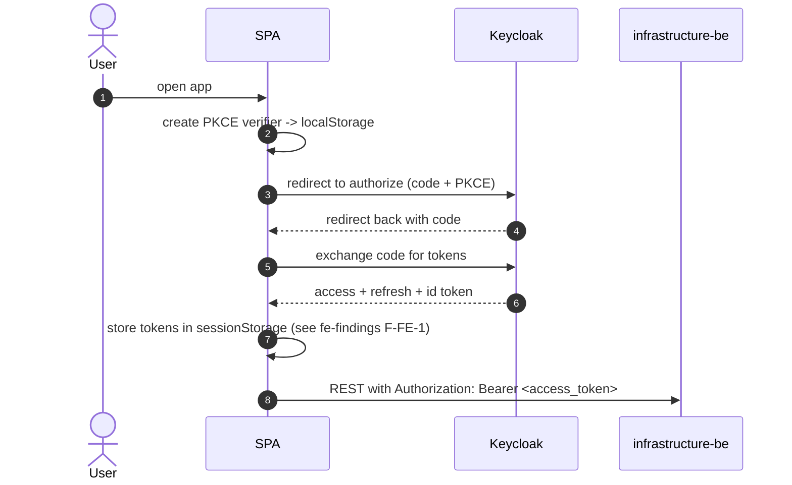

# infrastructure-fe: component architecture

React 18 + Vite single-page app (artifact `ionos-fe`), built to static assets and
served by nginx. In this stack it is published on the host at `:3001`.

## Structure and runtime configuration

Config is a mix: the **API base URL** and **Keycloak** settings are placeholder
tokens (`##VITEAPIBASEURL##`, etc.) baked into the bundle and rewritten by the
container entrypoint via `sed` at start. This is a runtime-config pattern (build
once, configure at deploy), but string-replacing minified JS is brittle
(see fe-findings F-FE-3).

## Authentication flow

The SPA implements the OAuth2 Authorization Code + PKCE flow by hand (it does not
use `keycloak-js`):

Because this stack has no Keycloak, the app renders and initiates the auth redirect
but cannot reach the authenticated UI. The backend accepts requests regardless
(auth disabled), so the API is reachable directly for testing.

## Security-relevant facts

- Access and refresh tokens live in `sessionStorage`; the PKCE verifier in
  `localStorage` (fe-findings F-FE-1).
- nginx serves **no** security headers and there is no CSP (fe-findings F-FE-2).
- Route authorisation reads roles from `sessionStorage` (client-side only;
  fe-findings F-FE-3).
- No secrets are committed: `.env` holds only URLs and the public Keycloak client id
  `frontend-cli` (public client + PKCE).

## Build and test

- Build: `npm ci` then `vite build` (Node 18 in the Dockerfile; builds under newer
  Node too). Output is static assets served by nginx.
- Tests: Cypress **component** tests (`npx cypress run --component`), 26 specs. Run
  headless with the bundled Electron. See fe-findings F-FE-4 for the current pass/fail
  and the Node-version caveat.
