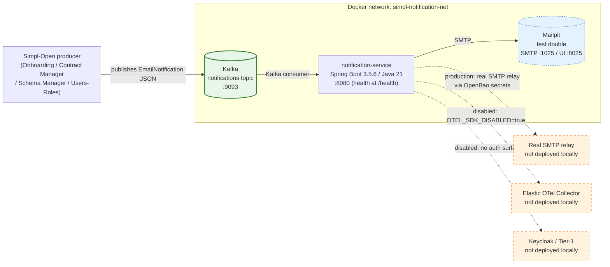
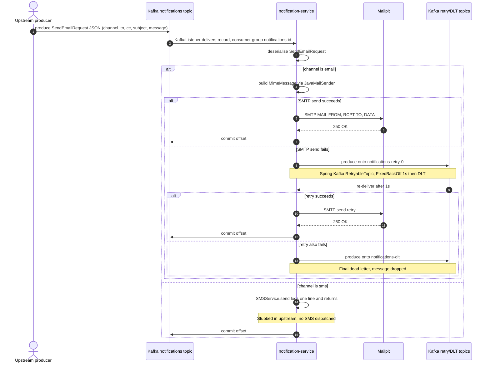

# notification-service — architecture overview

A short reference for what `notification-service` is, what it talks to in our local stack, and what it would talk to in a fuller deployment.

## At a glance

Solid arrows = hard dependencies (must be reachable). Dashed arrows = disabled / optional in this stack.

## What runs in our local stack

| Component | Image | Port(s) | Purpose |
|---|---|---|---|
| `notification-service` | `simpl-notification-service:local` | `8081→8080` | Kafka consumer; dispatches emails |
| `kafka` | `confluentinc/cp-kafka:7.5.0` | `9093` | Message broker; holds `notifications` topic |
| `zookeeper` | `confluentinc/cp-zookeeper:7.5.0` | — (internal) | Kafka coordination |
| `kafka-ui` | `provectuslabs/kafka-ui:v0.7.1` | `9081` | Browse topics and inspect messages |
| `mailpit` _(test only)_ | `axllent/mailpit:v1.21` | `1025` (SMTP), `8025` (UI) | Test double for the production SMTP relay — captures outbound email for inspection. Via `docker-compose.test.yml`. |

## Why email capture with Mailpit

In production, the notification service connects to an SMTP relay (configured via OpenBao secrets). Locally we use Mailpit: a zero-config SMTP server that accepts any message without authentication and provides a web UI to inspect what was sent. This lets us verify the end-to-end flow (Kafka message → email dispatch) without needing a real mail server or external credentials.

## What's intentionally NOT here

| Component | Status here | What it would do |
|---|---|---|
| Keycloak / Tier-1 gateway | Not deployed | AuthN/AuthZ — irrelevant; the service has no HTTP API |
| ArgoCD | Not deployed | Deployment orchestrator — out of scope for component evaluation |
| HashiCorp Vault / OpenBao | Not deployed | Secrets management — plain env vars used instead |
| Elastic OTel Collector | Not deployed | Telemetry export — `OTEL_SDK_DISABLED=true` suppresses the agent |
| Kafka SASL | Disabled | Production uses SASL_SSL; PLAINTEXT used locally |
| HA Kafka | Not configured | Single broker, replication factor 1 |

## Configuration that matters in our stack

| Env var | Value | Note |
|---|---|---|
| `KAFKA_BOOTSTRAP_SERVER` | `kafka:9093` | Internal Docker hostname |
| `KAFKA_SECURITY_PROTOCOL` | `PLAINTEXT` | Overrides production SASL_SSL |
| `SMTP_HOST` | `mailpit` | Internal Docker hostname |
| `SPRING_MAIL_PORT` | `1025` | Overrides hardcoded `587` in `application.properties` |
| `SPRING_MAIL_PROPERTIES_MAIL_SMTP_AUTH` | `false` | Overrides hardcoded `true` — Mailpit needs no auth |
| `SPRING_MAIL_PROPERTIES_MAIL_SMTP_STARTTLS_ENABLE` | `false` | Overrides hardcoded `true` — Mailpit uses plain SMTP |
| `OTEL_SDK_DISABLED` | `true` | Suppresses Elastic OTel agent loaded by Dockerfile CMD |
| `PROJECT_RELEASE_VERSION` | `local` | Required for `mvnw` — `pom.xml` uses `${env.PROJECT_RELEASE_VERSION}` |
| `MANAGEMENT_ENDPOINTS_WEB_BASE_PATH` | `/` | Policy: health endpoint must not be under `/actuator`; exposes at `/health` |

## Sequence — message in, email out

The diagram is GitHub-Mermaid-safe (no embedded HTML, no semicolons inside Notes,
no nested parens). It also renders in VS Code, IntelliJ, and GitLab.

## Process model (prose)

1. Some upstream Simpl-Open producer (schema-manager, contract-manager, etc.) writes a
   JSON `EmailNotification` to the Kafka `notifications` topic. The notification-service
   exposes **no HTTP API** for accepting notifications; Kafka is the only ingress.
2. The notification-service's consumer group `notifications-id` picks the message up.
3. Channel dispatch:
   - `channel: "email"` — the service calls `JavaMailSender` with `to`, `cc`, `subject`,
     `message`. The SMTP target is configured per the env-var table above.
   - `channel: "sms"` — the upstream `SMSService.send()` is a stub that logs one line
     and returns. No SMS is dispatched. See the parent README's FAIL assessment.
4. On SMTP failure, Spring Kafka's `@RetryableTopic` republishes onto an auto-created
   `notifications-retry-0` topic with `FixedBackOff(1000L, 1)` — one retry after 1
   second, then the message moves to `notifications-dlt` and is dropped. There is no
   manual replay tooling.

No application state is persisted by the notification-service itself. If the process
restarts, Kafka offset management (group `notifications-id`) ensures messages already
acknowledged aren't re-delivered.

## Kafka topics & consumers

| Topic | Direction | Notes |
|---|---|---|
| `notifications` | Consumed (group `notifications-id`) | Primary ingress. Any upstream Simpl-Open producer can publish here; payload is JSON-encoded `EmailNotification`. |
| `notifications-retry-0` | Produced AND consumed by the same service | Auto-created by Spring Kafka's `@RetryableTopic`. One retry after 1s. Nothing else consumes it. |
| `notifications-dlt` | Produced | Final dead-letter destination after the single retry exhausts. No consumer; the message is effectively dropped. |

The retry/DLT topics are internal plumbing — no other Simpl-Open component is expected
to observe them. Kafka-UI on `:9081` is the only practical way to inspect them locally.

## HTTP endpoints

Although the notification-service has no business-logic HTTP API, the Spring Boot
process does expose:

| Path | Auth | Purpose |
|---|---|---|
| `/health` | none | Spring Boot Actuator health, served at root per `MANAGEMENT_ENDPOINTS_WEB_BASE_PATH=/`. Returns `{"status":"UP"}` once the application context has finished initialising — even if the Kafka consumer has subsequently crashed. |

The `spring.api-key` configuration property (env `API_KEY`) and the bundled
`AuthenticationFilter` are present in the upstream code but guard no routes any external
caller would use. Authentication failures appear in the logs when something probes a
non-existent endpoint with the wrong header; they are not a sign that an integration
exists.

## Production vs. local

| Concern | Production | Local (this stack) |
|---|---|---|
| Kafka transport | `SASL_SSL` | `PLAINTEXT` — but see the upstream-issues note below |
| Kafka broker | EU Kafka cluster | `confluentinc/cp-kafka:7.5.0` single-broker via Zookeeper |
| SMTP relay | OVH (`ssl0.ovh.net:587`), STARTTLS + AUTH, credentials from OpenBao | `mailpit:1025`, no auth, no TLS; web UI on `:8025` |
| `email.address` recipient | Set per deployment (operator override) | Defaulted by upstream — see SSM-related note in [`upstream-issues.md`](upstream-issues.md) |
| Auth gateway | Tier-1 + Tier-2 | None (no business HTTP API) |
| OTel | Elastic OTel agent reports to common collector | Agent loaded but suppressed by `OTEL_SDK_DISABLED=true` |
| Image source | Pre-built JAR from GitLab CI, single-stage `Dockerfile` | Source-built JAR via multi-stage `Dockerfile.local` |
| Version | Set by GitLab CI pipeline | `PROJECT_RELEASE_VERSION=local` |

**Important caveat** — the consumer in this codebase silently expects
`SASL_PLAINTEXT` + `PLAIN` mechanism regardless of how `KAFKA_SECURITY_PROTOCOL` is
configured. Against the `PLAINTEXT` broker in this local stack, the consumer crashes
at startup with `Unexpected handshake request with client mechanism PLAIN`. The
Spring Boot process stays "up" and `/health` reports OK, but no message will ever be
consumed and Mailpit will stay empty. Full details in
[`upstream-issues.md`](upstream-issues.md). To watch the full email path end-to-end,
run the sibling `simpl-schema-manager` stack with `./start.sh --with-notifications`
— that stack configures its Kafka broker as `SASL_PLAINTEXT` to satisfy the hardcoded
consumer expectations.

## See also

- [Manual setup walkthrough](notification-service-manual-setup.md)
- [Upstream issues found during evaluation](upstream-issues.md)
- [Main README](../README.md)
