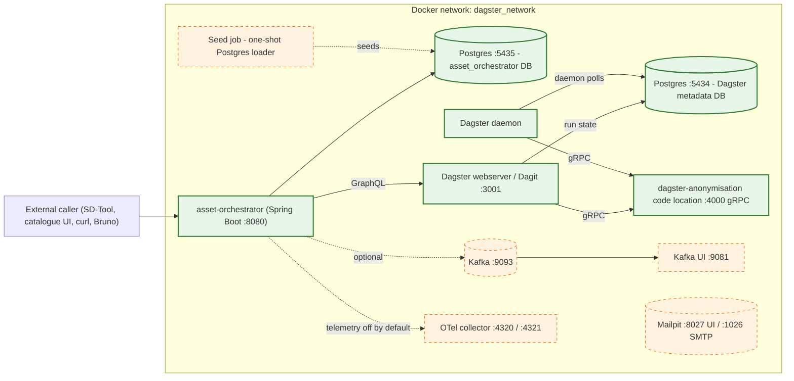
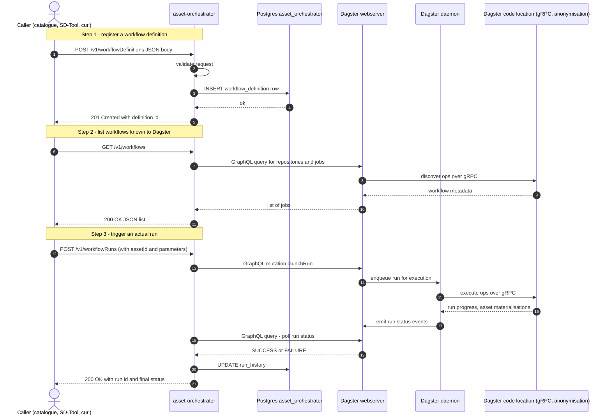

# simpl-orchestration — architecture overview

A short reference for what the orchestration platform is, what runs in our local
stack, and how the moving parts fit together.

The platform is built on **Dagster** (the workflow engine) plus the
**asset-orchestrator** (a SIMPL-developed Spring Boot service that bridges the
catalogue's data/application offerings to Dagster workflows). The local stack adds
Postgres, Kafka, Kafka UI, Mailpit, and an OpenTelemetry collector around them.

## At a glance

Solid green = hard dependencies for the happy-path flow. Dashed orange = optional or
disabled in this stack (Mailpit is wired but no producer in this stack actually sends
through it; OTel is loaded but suppressed; Kafka is reachable but the asset-orchestrator's
Kafka use is currently incidental in local mode).

## Sequence — register a workflow and execute it via Dagster

Steps 1 and 2 are exercised verbatim by the Bruno smoke tests
([`bruno/04-create-and-verify-workflow-definition.bru`](../bruno/04-create-and-verify-workflow-definition.bru)
and [`bruno/03-list-workflows.bru`](../bruno/03-list-workflows.bru)). Step 3 is the
production flow; locally a run executes via Dagster's `DefaultRunLauncher` as a
subprocess rather than via `K8sRunLauncher` as a Kubernetes job — same orchestration
logic, different launch mechanism.

The diagram is GitHub-Mermaid-safe (no embedded HTML, no semicolons inside Notes,
no nested parens). It also renders in VS Code, IntelliJ, and GitLab.

## What runs in our local stack

| Component | Image | Port(s) | Purpose |
|---|---|---|---|
| `asset-orchestrator` | source-built `simpl-asset-orchestrator` | `8080` | REST API, persistence, GraphQL bridge to Dagster |
| `postgres` (app) | `postgres:17.6` | `5435->5432` | asset-orchestrator's main database |
| `dagster-postgres` | `postgres:17.6` | `5434->5432` | Dagster's own metadata store (run history, schedules, events) |
| `docker_dagster_webserver` | source-built `dagster` | `3001->3000` | Dagit UI + GraphQL API |
| `dagster-daemon` | source-built `dagster` | — | Long-running daemon for schedules, sensors, run queue |
| `dagster-anonymisation` | source-built `dataframe-level-anonymisation` | `4000` (gRPC, internal only) | Workflow code location — the actual ops/jobs |
| `zookeeper` | `confluentinc/cp-zookeeper:7.5.0` | — | Kafka coordination |
| `kafka` | `confluentinc/cp-kafka:7.5.0` | `9093->9092` | Broker (single, no SASL) |
| `kafka-ui` | `provectuslabs/kafka-ui:latest` | `9081->8080` | Browse topics |
| `mailpit` | `axllent/mailpit:latest` | `8027->8025` UI, `1026->1025` SMTP | Email-capture sink — wired but no producer in this stack |
| `otel-collector` | `otel/opentelemetry-collector:latest` | `4320->4317` gRPC, `4321->4318` HTTP | Telemetry collector — agent disabled by default |
| `seed` | `postgres:17.6` (one-shot) | — | Loads seed CSV/SQL data once `asset-orchestrator` is healthy, then exits |
| `bruno-smoke-test` | `node:20-alpine` (one-shot, `--profile tests`) | — | Optional API smoke tests |

## Workflow code locations

A Dagster **code location** is a Python module hosting a set of ops/jobs. The
webserver and daemon discover them over gRPC. The local stack registers one:

| Code location | Source repo | What it does | Status |
|---|---|---|---|
| `dataframe-level-anonymisation` | `data-services/dataframe-level-anonymisation` | CSV ingest → anonymisation transforms → CSV output, all in-process via pandas | ✅ Fully working; gRPC server on `dagster-anonymisation:4000` |
| `field-level-pseudo-anonymisation` | `data-services/field-level-pseudo-anonymisation` | NLP-driven field-level pseudo-anonymisation using spaCy | ❌ Disabled in this stack — 3.5 GB image, known typer/spaCy dependency conflict; commented out in `docker-compose.yml` and absent from `dagster/workspace.yaml` |

To enable additional code locations, add a `grpc_server` entry to
[`dagster/workspace.yaml`](../dagster/workspace.yaml) and a corresponding service to
`docker-compose.yml`.

## Asset Orchestrator API — endpoints exercised

Full Swagger at [http://localhost:8080/v1/swagger-ui.html](http://localhost:8080/v1/swagger-ui.html)
once the stack is up. The Bruno smoke tests cover the load-bearing subset:

| Path | Method | Bruno test | Purpose |
|---|---|---|---|
| `/v1/actuator/health` | GET | `01-health-check.bru` | Spring Boot Actuator — application + DB liveness |
| `/v1/actuator/health` | GET | `06-health-check-dagster-integration.bru` | Same endpoint, but verifies the Dagster integration health indicator is `UP` |
| `/v1/workflowDefinitions` | GET | `02-list-catalog-assets.bru`, `05-verify-workflow-definition-persisted.bru` | List workflow definitions registered against an `assetId` |
| `/v1/workflowDefinitions` | POST | `04-create-and-verify-workflow-definition.bru` | Register a new workflow definition against an asset |
| `/v1/workflows` | GET | `03-list-workflows.bru` | List the workflows Dagster knows about (via GraphQL) |

The "workflow definition" is asset-orchestrator's own concept — it binds a Dagster
job to a catalogue asset and configures how the workflow should be triggered (input
sources, parameters, schedule). A workflow definition is what gets created; a
workflow run is what executes.

## Production vs. local

| Concern | Production | Local (this stack) |
|---|---|---|
| Auth | Tier-1 + Tier-2 gateways, OAuth2 via Keycloak | None — asset-orchestrator listens directly on `:8080` with no gateway in front |
| Dagster run launcher | `K8sRunLauncher` — each run is a Kubernetes job | `DefaultRunLauncher` — each run is a subprocess of the daemon |
| Code locations | One Kubernetes deployment per location, fronted by gRPC service | One Docker container per location, gRPC over the bridge network |
| Workspace config | `workspace.yaml` baked into the image / mounted from configmap | `workspace.yaml` bind-mounted from the host so reloads are immediate |
| Compute logs and artifacts | S3 or PVC | `/data` inside the code-location container (volume-less; ephemeral) |
| `dagster.yaml` storage backend | Postgres (Dagster's metadata DB) + S3 for artifacts | Postgres (Dagster's metadata DB) + ephemeral local for artifacts |
| Kafka transport | `SASL_SSL` | `PLAINTEXT` |
| Vault | HashiCorp Vault for secrets | Plain env vars in `.env.local` |
| OTel | Agent reports to common collector | `otel-collector` container present but agent disabled by default |
| Image source | Pre-built JARs / wheels from GitLab CI | Source-built via per-component Dockerfiles in `dagster-patches/` and `repos/` |
| Source for seed data | Catalogue-driven, no separate seed | One-shot Postgres `seed` container loads `seed/seed.sql` after the asset-orchestrator is healthy |

## See also

- [Main README](../README.md) — quick start, prerequisites, Dagster walkthrough.
- [Bruno smoke tests](../bruno/) — runnable HTTP probes for each endpoint above.
- [`dagster/workspace.yaml`](../dagster/workspace.yaml) — the canonical list of code
  locations Dagster discovers at startup.
- Upstream docs:
  - [asset-orchestrator README](https://code.europa.eu/simpl/simpl-open/development/orchestration-platform/asset-orchestrator/-/blob/main/README.md)
  - [Dagster deployment guide](https://code.europa.eu/simpl/simpl-open/development/orchestration-platform/dagster-dev-local/-/blob/main/README.md)
