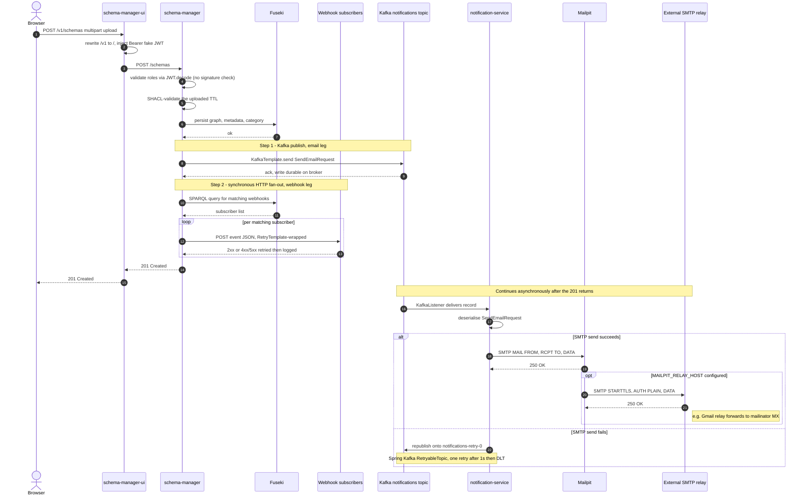

# Schema Manager — local stack architecture

## Component diagram

```
       ┌──────────────────────────────────┐
       │ schema-manager-ui (Vue 3, nginx) │   ◀── browser opens this
       │ :4322 host  →  :8080 container   │
       │                                  │
       │  GET /         → index.html      │
       │  GET /v1/...   → rewritten,      │
       │                  Authorization   │
       │                  injected,       │
       │                  proxy_pass      │
       └──────┬──────────────────┬────────┘
              │                  │
    direct API│                  │ proxied /v1/* with auth header
    (curl etc)│                  │
              ▼                  ▼
       ┌──────────────────────────────┐
       │ schema-manager (Spring Boot) │
       │  /webhooks   /schemas/...    │
       │  :8085                       │
       └────┬──────────────┬──────────┘
            │              │
  SPARQL    │              │ Kafka producer
            │              │ (topic: notifications)
            ▼              ▼
      ┌───────────┐   ┌──────────┐        ┌──────────┐
      │  Fuseki   │   │  Kafka   │───────▶│ Kafka UI │
      │  :3030    │   │  :9094   │        │  :9001   │
      └───────────┘   └────┬─────┘        └──────────┘
                           │
                           │ Kafka consumer (only with --with-notifications)
                           ▼
                  ┌──────────────────────────┐
                  │  simpl-notification-     │
                  │  service (Spring Boot    │
                  │  Kafka listener)         │
                  └──────────┬───────────────┘
                             │ SMTP
                             ▼
                  ┌──────────────────────────┐
                  │  Mailpit                 │ ──── optional outbound relay 
                  │  :1025 SMTP, :8025 UI    │    
                  └──────────────────────────┘
```

All containers run on a single Docker bridge network (`simpl-schema-manager-net`).
Mailpit and notification-service appear only when `./start.sh --with-notifications` is
used; otherwise the schema-manager produces to Kafka but nothing consumes the topic.
Keycloak is deliberately omitted — see [`schema-manager-bypass.md`](schema-manager-bypass.md)
for how the UI and backend agree to operate without it.

## Sequence — schema upload to email delivery

A single schema-upload from the UI triggers **two independent notification paths**
inside the schema-manager, fired sequentially within the same HTTP request, in this
order:

1. **Email path — Kafka.** `NotificationService.sendEmailNotification()` produces a
   `SendEmailRequest` message onto the Kafka `notifications` topic. The
   `KafkaTemplate.send()` returns as soon as the broker acknowledges the write —
   downstream consumption is asynchronous, owned by the notification-service.
   This call is gated by `kafka.enabled` (see [`Kafka usage` in the README](../README.md#kafka-usage));
   `SchemaService.createSchema` calls it before doing anything with the webhook fan-out.
2. **Webhook path — pure HTTP, no broker.** `EventService.notifyWebhooksOnSchemaChanges()`
   then reads the `ds_webhooks` Fuseki dataset for subscribers whose `events[]`
   matches the current event type and POSTs the event JSON to each subscriber via
   Spring's `RestTemplate` (wrapped in `RetryTemplate`). This is synchronous per
   subscriber: the schema-manager waits for each HTTP response before moving on.

Only after both legs have been initiated does `createSchema` return its
`CreateSchemaResponse` and the controller emit `201 Created`. The Kafka publish has
already happened by then; the email itself is still in flight (the notification-service
hasn't necessarily consumed and SMTP-dispatched it yet). The webhook POSTs have
fully completed (success or final-retry failure) by the time the user sees `201`.



The diagram is written for the GitHub-flavoured Mermaid renderer (no embedded HTML,
no semicolons inside Notes); it renders identically in VS Code, IntelliJ, and GitLab.
Read as plain text it still conveys ordering.

## Kafka topics & consumers

The schema-manager produces one type of message on a single Kafka topic:

| Topic | Producer | Consumer(s) | When | Payload |
|---|---|---|---|---|
| `notifications` | `schema-manager` (`NotificationService.sendEmailNotification()`) | `simpl-notification-service` (only with `--with-notifications` overlay) | On every schema lifecycle event: create, new-version, publish, revoke | JSON `SendEmailRequest` — `{ channel: "email", to, cc, subject, message }` |

The `to:` field is filled from the schema-manager's `${email.address}` configuration,
which defaults to a **public Mailinator inbox** — see
[`upstream-issues.md`](upstream-issues.md) for the security implications and the
suggested fix. Mailpit captures the dispatched email locally; if the operator
additionally configures Mailpit relay credentials in `.env`, the email is also
forwarded to a real SMTP relay (and from there to the addressed recipient — i.e. the
public Mailinator inbox).

**Note on the consumer side** — the upstream notification-service has its own
upstream defect (see [its upstream-issues notes](../../simpl-notification-service/docs/upstream-issues.md))
where its `ConsumerConfig` Spring bean hardcodes `security.protocol=SASL_PLAINTEXT`
+ `sasl.mechanism=PLAIN`. To satisfy that, this stack's Kafka broker is configured
with the matching SASL settings (with throwaway local credentials). Without that
configuration alignment the consumer would crash at startup and the notification
path would silently fail. See [`schema-manager-bypass.md`](schema-manager-bypass.md)
for the related but separate Keycloak bypass.

## Datasets

At boot the schema-manager calls Fuseki's admin API to create four named datasets:

| Dataset | Purpose |
|---|---|
| `ds_schemas` | Canonical schema graphs (SHACL shapes, JSON-LD contexts) |
| `ds_schema_metadata` | Schema descriptors (name, version, category, owner) |
| `ds_schema_categories` | Category taxonomy |
| `ds_webhooks` | Webhook subscriber registrations |

Confirming these exist in Fuseki is the easiest liveness check after a boot.

## Endpoints

| Path | Auth | Notes |
|---|---|---|
| `GET /webhooks` | none | Returns `[]` when no subscribers registered. Used by `start.sh` smoke test. |
| `POST /webhooks` | Tier-1 JWT | Register a webhook for schema-change events. |
| `GET /schemas` | Tier-1 JWT | List schemas. Without `Authorization` header returns Belgif RFC-7807 400. |
| `GET /schemas/{name}` | Tier-1 JWT | Fetch a single schema. |
| `GET /schemas/{name}/versions` | Tier-1 JWT | List versions of a schema. |
| `GET /schemas/{name}/{version}` | Tier-1 JWT | Fetch a specific version. |

## Production vs. local

| Concern | Production | Local |
|---|---|---|
| Auth | Keycloak → Tier-1 → Tier-2 → schema-manager | Bypassed; auth-gated endpoints return 400 |
| Fuseki credentials | OpenBao secret | Plain env var (`admin1234`) |
| Kafka transport | `SASL_SSL` (production) | `SASL_PLAINTEXT` with `PLAIN` mechanism + throwaway local credentials — matches the hardcoded protocol/mechanism in the upstream notification-service's `ConsumerConfig.class` (see [the notification-service upstream issues](../../simpl-notification-service/docs/upstream-issues.md)). A plain `PLAINTEXT` broker would cause the consumer to crash at startup. |
| Fuseki persistence | PVC | Ephemeral (datasets re-created at each boot) |
| Image source | Pre-built JAR from GitLab CI, single-stage `Dockerfile` | Source-built JAR via multi-stage `Dockerfile.local` |
| Version | Set by GitLab CI pipeline | `PROJECT_RELEASE_VERSION=local` |
