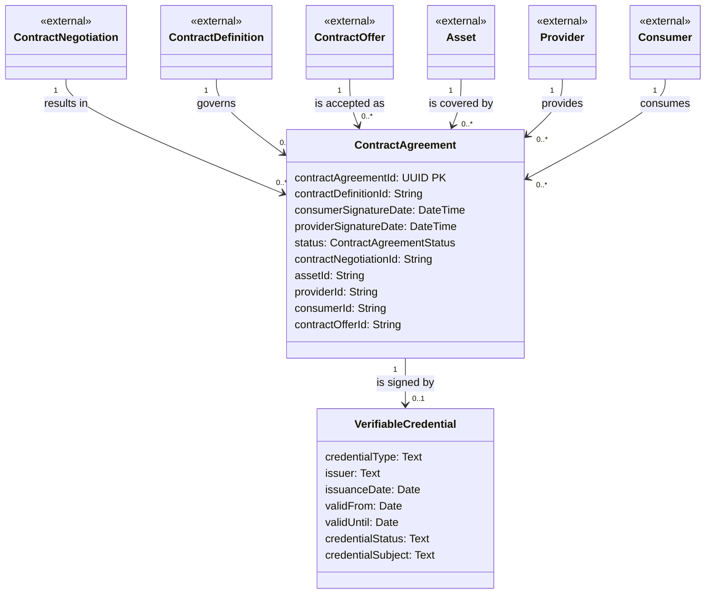

## Purpose

- API definition: https://code.europa.eu/simpl/simpl-open/development/contract-billing/contract/-/blob/main/openapi/openapi3-v1.yaml

## Conceptual Model

```mermaid
classDiagram
    class ContractAgreement {
        contractAgreementId: UUID PK
        contractDefinitionId: String
        consumerSignatureDate: DateTime
        providerSignatureDate: DateTime
        status: ContractAgreementStatus
        contractNegotiationId: String
        assetId: String
        providerId: String
        consumerId: String
        contractOfferId: String
    }

    class ContractDefinition {
        <<external>>
    }

    class ContractNegotiation {
        <<external>>
    }

    class ContractOffer {
        <<external>>
    }

    class Asset {
        <<external>>
    }

    class Provider {
        <<external>>
    }

    class Consumer {
        <<external>>
    }

    class VerifiableCredential {
        credentialType: Text
        issuer: Text
        issuanceDate: Date
        validFrom: Date
        validUntil: Date
        credentialStatus: Text
        credentialSubject: Text
    }

    ContractNegotiation "1" --> "0..*" ContractAgreement : results in
    ContractDefinition "1" --> "0..*" ContractAgreement : governs
    ContractOffer "1" --> "0..*" ContractAgreement : is accepted as
    Asset "1" --> "0..*" ContractAgreement : is covered by
    Provider "1" --> "0..*" ContractAgreement : provides
    Consumer "1" --> "0..*" ContractAgreement : consumes

    ContractAgreement "1" --> "0..1" VerifiableCredential : is signed by
```