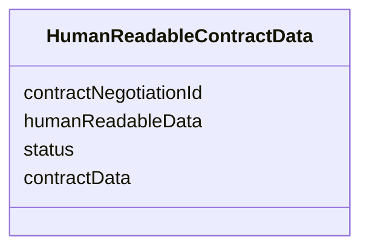

## Purpose

- API definition: https://code.europa.eu/simpl/simpl-open/development/contract-billing/contract-ui-backend/-/blob/develop/openapi/openapi3-v1.yaml

## Conceptual Model

```mermaid
classDiagram

class HumanReadableContractData {
    contractNegotiationId
    humanReadableData
    status
    contractData
}
```