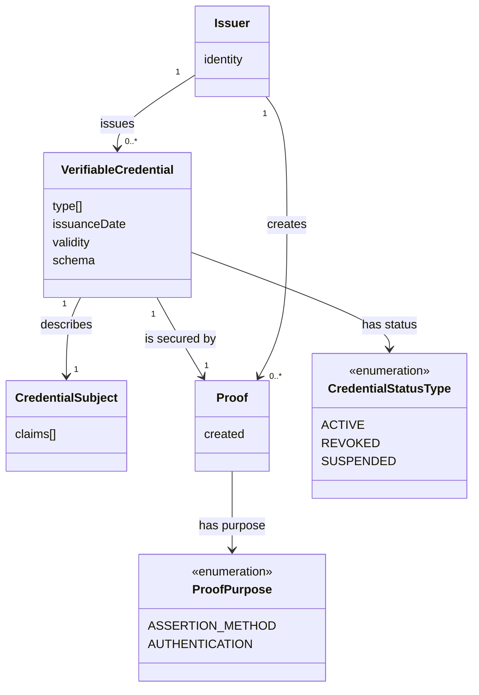

### Purpose

- API definition: https://code.europa.eu/simpl/simpl-open/development/contract-billing/vc-issuer-service/-/blob/main/openapi/openapi3-v1.yaml

### Conceptual Model

```mermaid
classDiagram

class VerifiableCredential {
    type[]
    issuanceDate
    validity
    schema
}

class Issuer {
    identity
}

class CredentialSubject {
    claims[]
}

class Proof {
    created
}

class ProofPurpose {
    <<enumeration>>
    ASSERTION_METHOD
    AUTHENTICATION
}

class CredentialStatusType {
    <<enumeration>>
    ACTIVE
    REVOKED
    SUSPENDED
}

Issuer "1" --> "0..*" VerifiableCredential : issues
VerifiableCredential "1" --> "1" CredentialSubject : describes
VerifiableCredential "1" --> "1" Proof : is secured by
Issuer "1" --> "0..*" Proof : creates

Proof --> ProofPurpose : has purpose
VerifiableCredential --> CredentialStatusType : has status
```