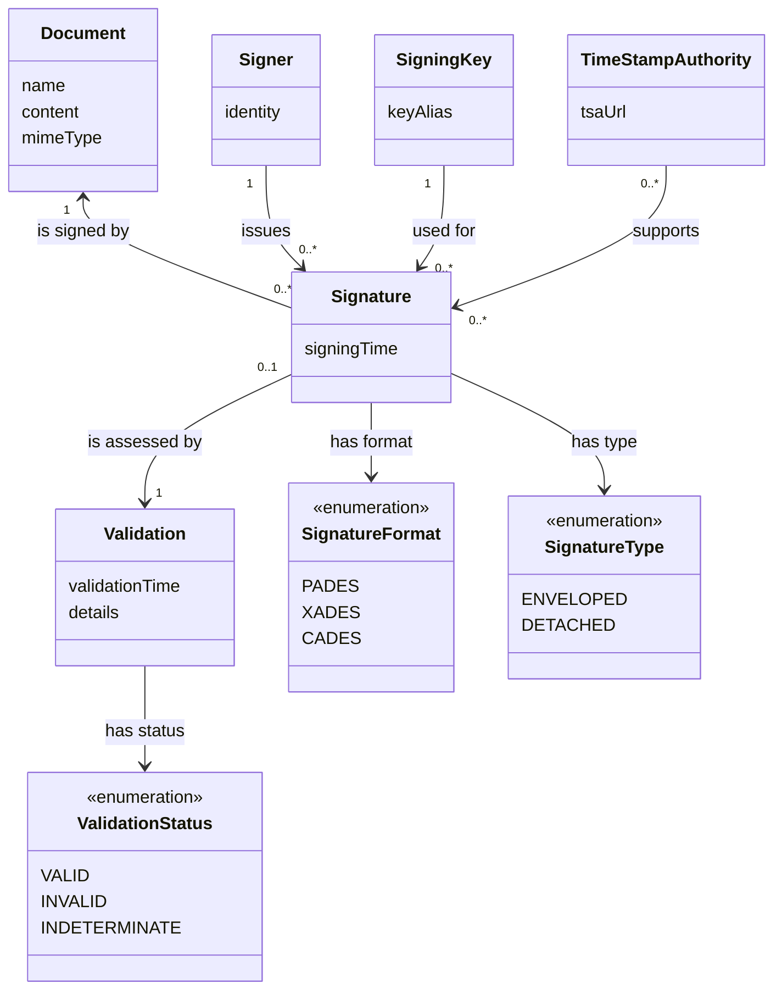

## Purpose

- API definition: https://code.europa.eu/simpl/simpl-open/security/credential-management/signing/signer/signer-service-be/-/blob/main/openapi/openapi3-v1.yaml

## Conceptual Model

```mermaid
classDiagram

class Document {
    name
    content
    mimeType
}

class Signature {
    signingTime
}

class Signer {
    identity
}

class SigningKey {
    keyAlias
}

class TimeStampAuthority {
    tsaUrl
}

class Validation {
    validationTime
    details
}

class SignatureFormat {
    <<enumeration>>
    PADES
    XADES
    CADES
}

class SignatureType {
    <<enumeration>>
    ENVELOPED
    DETACHED
}

class ValidationStatus {
    <<enumeration>>
    VALID
    INVALID
    INDETERMINATE
}

Document "1" <-- "0..*" Signature : is signed by
Signer "1" --> "0..*" Signature : issues
SigningKey "1" --> "0..*" Signature : used for
TimeStampAuthority "0..*" --> "0..*" Signature : supports
Signature "0..1" --> "1" Validation : is assessed by

Signature --> SignatureFormat : has format
Signature --> SignatureType : has type
Validation --> ValidationStatus : has status
```