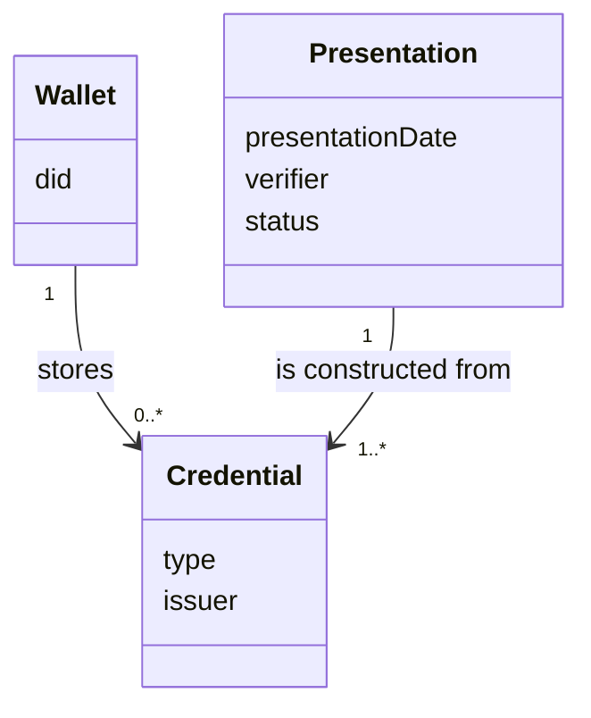

## Purpose

- API definition: https://code.europa.eu/simpl/simpl-open/development/contract-billing/wallet-service/-/blob/main/openapi/openapi3-v1.yaml

## Conceptual Model

```mermaid
classDiagram

class Wallet {
    did
}

class Credential {
    type
    issuer
}

class Presentation {
    presentationDate
    verifier
    status
}

Wallet "1" --> "0..*" Credential : stores
Presentation "1" --> "1..*" Credential : is constructed from
```
