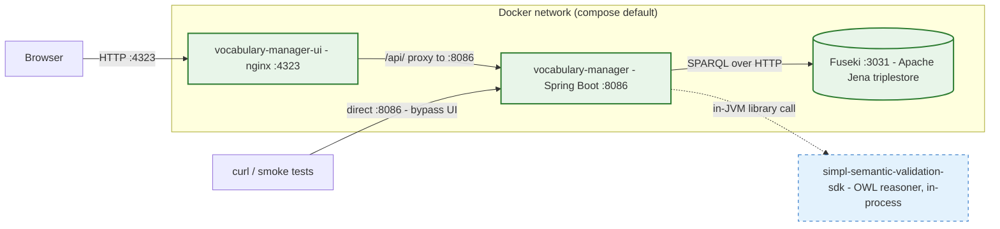
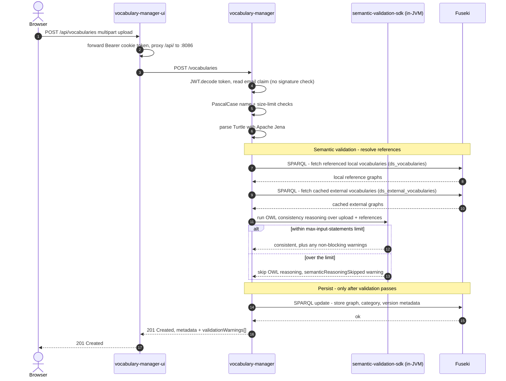

# Vocabulary Manager — local stack architecture

## At a glance

Solid green = the three containers that make up the local stack — they are all
"hard" dependencies, always started. Dashed blue = the
`simpl-semantic-validation-sdk` is **not a service**: it is a Maven library
linked into the backend JVM (resolved anonymously from the public code.europa.eu
registry at build time), invoked in-process during validation. There is no
Kafka, no Vault/OpenBao, no Keycloak, and no second backing store — Fuseki is
the only stateful component.

Keycloak is deliberately omitted on both tiers: the backend `JWT.decode()`s the
Bearer token without signature verification, and the UI's Keycloak switch is
disabled by empty `env-config.js` values. See the README's *Authentication*
section for the cookie that opens the UI role gates.

## Sequence — vocabulary upload with semantic validation

A single upload from the UI is a **synchronous, single-request** flow — unlike
the schema-manager there is no Kafka leg and no webhook fan-out. The one
non-trivial step is semantic validation, which reads back from Fuseki (and the
in-process OWL reasoner) before the vocabulary is persisted.

Unresolvable external namespaces do **not** fail the upload — they surface as
non-blocking `externalReferenceSkipped` warnings in the `validationWarnings[]`
array of the 201 response (this is what you see uploading the sample vocabulary,
whose own `example.org` namespace has no cached external entry). To make such a
reference resolve, register it first via `POST /external-vocabularies`, which
caches the external Turtle into the `ds_external_vocabularies` dataset.

The diagram is written for the GitHub-flavoured Mermaid renderer (no embedded
HTML, no semicolons inside Notes); it renders identically in VS Code, IntelliJ,
and GitLab. Read as plain text it still conveys ordering.

## Datasets

The backend uses two Fuseki named datasets (created on demand; the `--seed`
script ensures `ds_vocabularies` exists and loads demo data):

| Dataset | Purpose |
|---|---|
| `ds_vocabularies` | Internal vocabularies: category metadata, per-version metadata, and the Turtle content graphs served back as `text/turtle` |
| `ds_external_vocabularies` | Copies of external vocabularies registered as validation dependencies, looked up by original namespace + aliases during semantic validation |

Confirming both exist in Fuseki is the easiest liveness check after a boot — the
`start.sh` smoke test does exactly this.

## Endpoints

| Path | Auth | Notes |
|---|---|---|
| `GET /health` | none | `{"status":"UP"}`. Used by `start.sh` smoke test. |
| `GET /vocabularies` | none | List internal vocabularies (paginated). Smoke-tested. |
| `GET /vocabularies/{name}` | none | Fetch one vocabulary's metadata. |
| `GET /vocabularies/{name}/versions` | none | Version history. |
| `GET /vocabularies/{name}/versions/{version}` | none | One version's metadata. |
| `POST /vocabularies` | Bearer (`email` claim) | Create a vocabulary v1. Requires `vocabularyFile`, `name` (PascalCase 3–64), `description`, `changelog`. |
| `POST /vocabularies/{name}/versions` | Bearer (`email` claim) | Add a new version; version number is assigned automatically. |
| `PATCH /vocabularies/{name}` and `…/versions/{version}` | Bearer | Status/metadata changes. |
| `GET /content/{name}` and `…/versions/{version}` | none | Serve stored Turtle as `text/turtle`. |
| `GET/POST/DELETE /external-vocabularies[/{name}]` | Bearer on write | Register / list / remove cached external vocabularies. |

Write endpoints only *decode* the Bearer token for its `email` claim (recorded
as `createdBy`); the signature is never verified. The UI plants a long-lived
`token` cookie carrying `email` + `GA_VOCABULARY_ADMIN` (see README), which both
opens the UI's role gates and satisfies this decode.

## Production vs. local

| Concern | Production | Local |
|---|---|---|
| Auth (user) | Keycloak → Tier-1 → backend; UI runs the OIDC/PKCE flow | UI Keycloak switch disabled; planted admin cookie |
| Auth (API) | Platform gateway/IAA fronts the service; real signed JWTs | `JWT.decode()` only — any structurally valid token works |
| UI ↔ API | Served behind a gateway path (`/vocabulary-ui/`, `/vocabulary-manager/`) | nginx proxies relative `/api/` to the backend container (backend has no CORS) |
| UI base path | `/vocabulary-ui/` baked into the Vite build | Overridden to `/` at image build (`--base=/`) |
| Fuseki credentials | OpenBao secret | Plain env var (`admin1234`) |
| Fuseki persistence | PVC (StatefulSet) | Named Docker volumes, re-created per stack |
| semantic-validation-sdk | Resolved from GitLab CI with a token | Resolved anonymously from the public code.europa.eu Maven registry |
| Image source | Pre-built JAR + UI bundle from GitLab CI | Source-built via multi-stage `Dockerfile.local` / `Dockerfile.local-ui` |
| Version | Set by GitLab CI pipeline | `PROJECT_RELEASE_VERSION=0.0.1-local` |
| UI branch | `main` (once the app is merged there) | Pinned to `release-1.0.0` (upstream `main` is an empty stub) |
